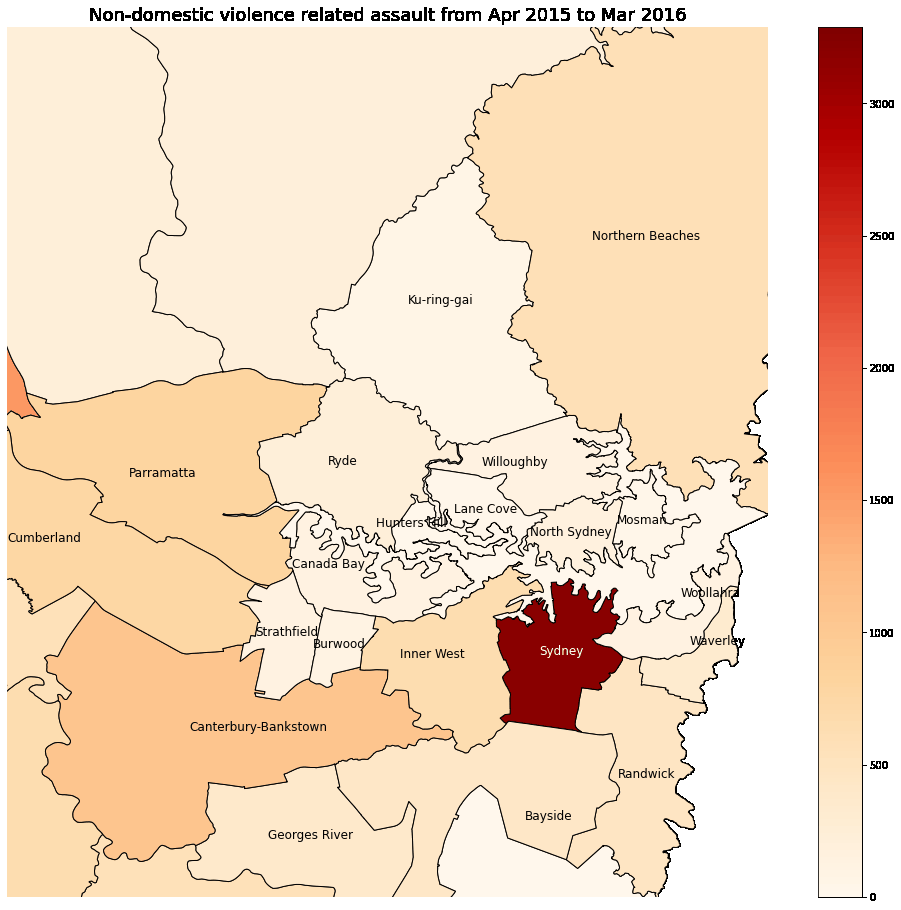
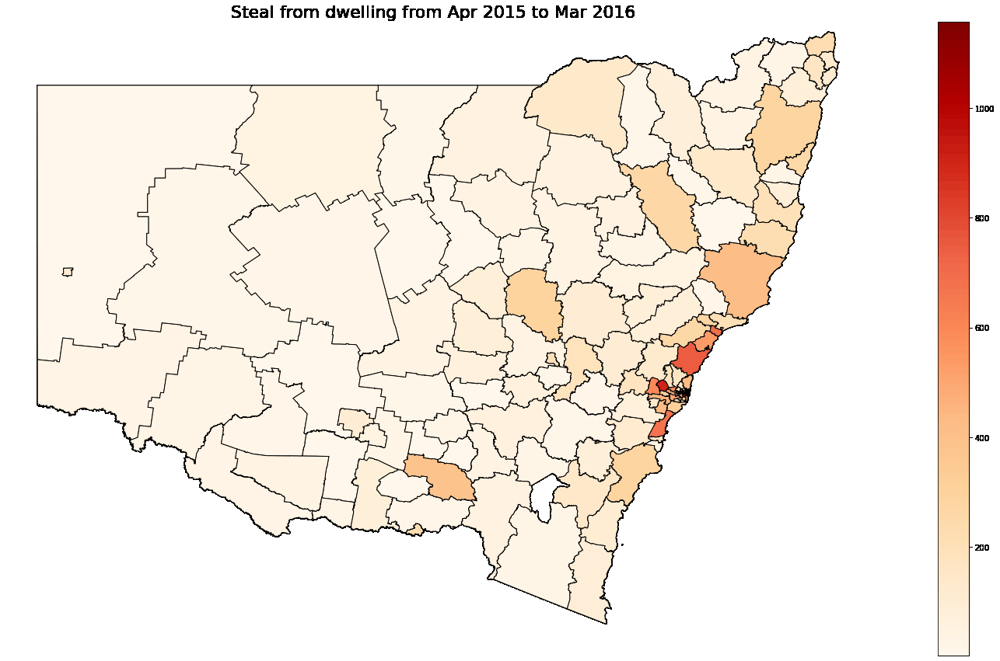
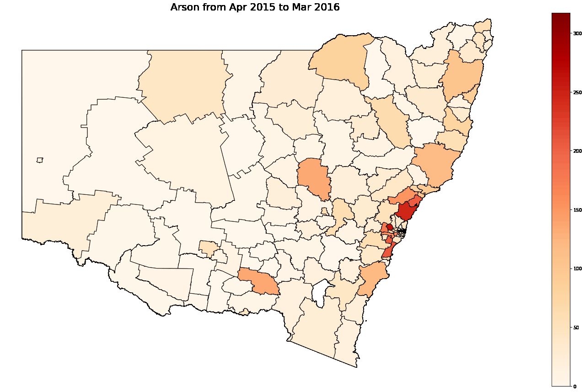
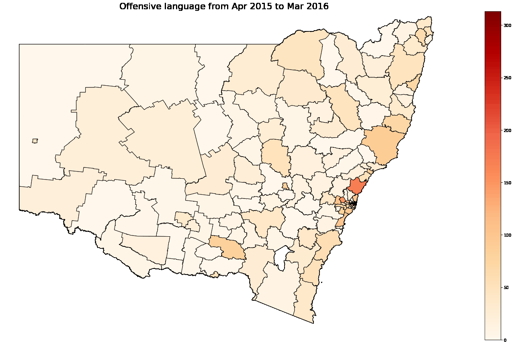
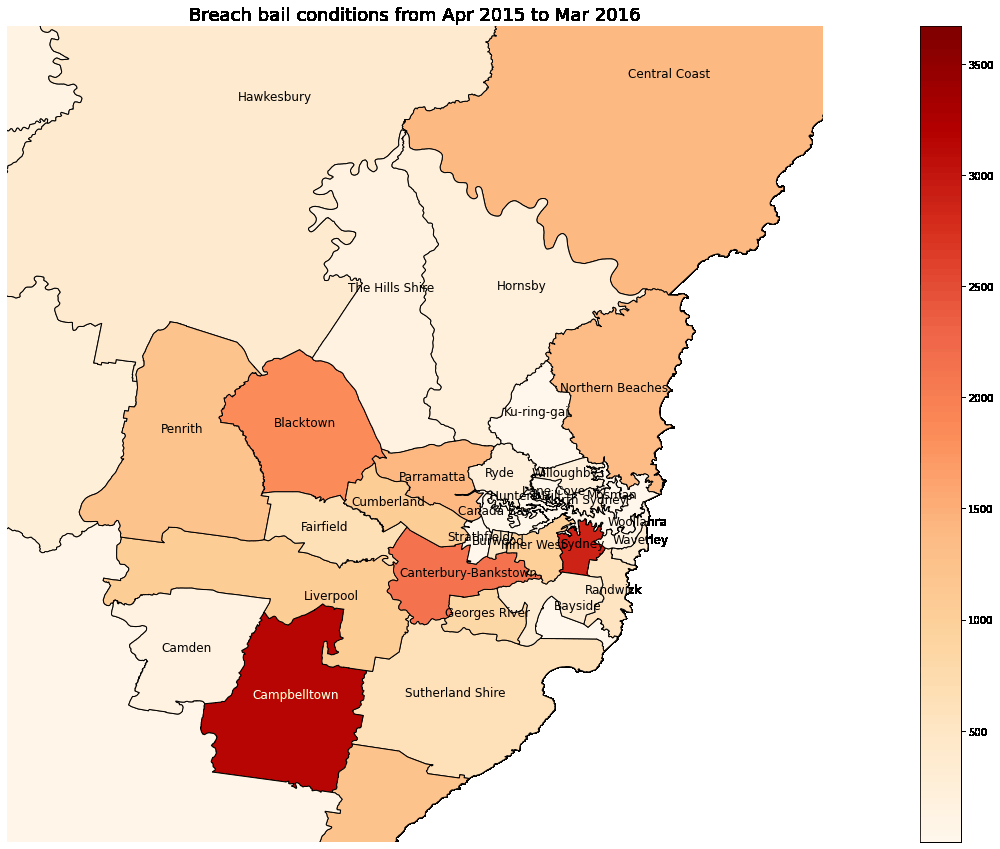

# Dynamic geospatial analysis of crimes in NSW

Python code to perform dynamic geospatial analysis of crimes based on data from the NSW Bureau of Crime Statistics and Research.

# Loading libraries

Let's load relevant Python libraries.


```python
import numpy as np 
import pandas as pd 
from IPython.display import display, Image, Markdown
import matplotlib.pyplot as plt 
import matplotlib as mpl
import geopandas as gpd
import os
import shutil
import imageio
import warnings
warnings.filterwarnings("ignore")
#pd.set_option('display.max_rows', 500)
#pd.set_option('display.max_columns', 500)
#pd.set_option('display.width', 1000)
```

# Loading data

The dataset was acquired from https://www.bocsar.nsw.gov.au/Pages/bocsar_datasets/Datasets-.aspxNSW.


```python
data = pd.read_excel('LGA_trends.xlsx', skiprows=3)
```

# Data cleaning


```python
data.shape
```


    (8133, 10)


The dataset has 8133 rows and 10 columns.


```python
data.head(10)
```


<div>
<style scoped>
    .dataframe tbody tr th:only-of-type {
        vertical-align: middle;
    }

    .dataframe tbody tr th {
        vertical-align: top;
    }

    .dataframe thead th {
        text-align: right;
    }
</style>
<table border="1" class="dataframe">
  <thead>
    <tr style="text-align: right;">
      <th></th>
      <th>Local Government Area</th>
      <th>Offence type</th>
      <th>Apr 2015 - Mar 2016</th>
      <th>Apr 2016 - Mar 2017</th>
      <th>Apr 2017 - Mar 2018</th>
      <th>Apr 2018 - Mar 2019</th>
      <th>Apr 2019 - Mar 2020</th>
      <th>Rate per 100,000 population Apr 2019 - Mar 2020</th>
      <th>2 year trend and annual percent change (Apr 2018-Mar 2020)</th>
      <th>5 year trend and average annual percent change (Apr 2015-Mar 2020)</th>
    </tr>
  </thead>
  <tbody>
    <tr>
      <th>0</th>
      <td>Albury</td>
      <td>Murder *</td>
      <td>0.0</td>
      <td>2.0</td>
      <td>0.0</td>
      <td>1.0</td>
      <td>0.0</td>
      <td>nc</td>
      <td>nc</td>
      <td>nc</td>
    </tr>
    <tr>
      <th>1</th>
      <td>Albury</td>
      <td>Attempted murder</td>
      <td>0.0</td>
      <td>1.0</td>
      <td>0.0</td>
      <td>0.0</td>
      <td>1.0</td>
      <td>1.9</td>
      <td>nc</td>
      <td>nc</td>
    </tr>
    <tr>
      <th>2</th>
      <td>Albury</td>
      <td>Murder accessory, conspiracy</td>
      <td>0.0</td>
      <td>0.0</td>
      <td>0.0</td>
      <td>0.0</td>
      <td>0.0</td>
      <td>nc</td>
      <td>nc</td>
      <td>nc</td>
    </tr>
    <tr>
      <th>3</th>
      <td>Albury</td>
      <td>Manslaughter *</td>
      <td>0.0</td>
      <td>0.0</td>
      <td>0.0</td>
      <td>0.0</td>
      <td>0.0</td>
      <td>nc</td>
      <td>nc</td>
      <td>nc</td>
    </tr>
    <tr>
      <th>4</th>
      <td>Albury</td>
      <td>Domestic violence related assault</td>
      <td>273.0</td>
      <td>297.0</td>
      <td>266.0</td>
      <td>294.0</td>
      <td>314.0</td>
      <td>584</td>
      <td>Stable</td>
      <td>Stable</td>
    </tr>
    <tr>
      <th>5</th>
      <td>Albury</td>
      <td>Non-domestic violence related assault</td>
      <td>329.0</td>
      <td>294.0</td>
      <td>316.0</td>
      <td>356.0</td>
      <td>350.0</td>
      <td>651</td>
      <td>Stable</td>
      <td>Up 1.6%</td>
    </tr>
    <tr>
      <th>6</th>
      <td>Albury</td>
      <td>Assault Police</td>
      <td>35.0</td>
      <td>19.0</td>
      <td>22.0</td>
      <td>28.0</td>
      <td>29.0</td>
      <td>53.9</td>
      <td>Stable</td>
      <td>nc</td>
    </tr>
    <tr>
      <th>7</th>
      <td>Albury</td>
      <td>Sexual assault</td>
      <td>48.0</td>
      <td>55.0</td>
      <td>54.0</td>
      <td>51.0</td>
      <td>72.0</td>
      <td>133.9</td>
      <td>Stable</td>
      <td>Up 10.7%</td>
    </tr>
    <tr>
      <th>8</th>
      <td>Albury</td>
      <td>Indecent assault, act of indecency and other s...</td>
      <td>77.0</td>
      <td>90.0</td>
      <td>68.0</td>
      <td>86.0</td>
      <td>93.0</td>
      <td>173</td>
      <td>Stable</td>
      <td>Stable</td>
    </tr>
    <tr>
      <th>9</th>
      <td>Albury</td>
      <td>Abduction and kidnapping</td>
      <td>3.0</td>
      <td>1.0</td>
      <td>2.0</td>
      <td>2.0</td>
      <td>6.0</td>
      <td>11.2</td>
      <td>nc</td>
      <td>nc</td>
    </tr>
  </tbody>
</table>
</div>


```python
data.tail(15)
```


<div>
<style scoped>
    .dataframe tbody tr th:only-of-type {
        vertical-align: middle;
    }

    .dataframe tbody tr th {
        vertical-align: top;
    }

    .dataframe thead th {
        text-align: right;
    }
</style>
<table border="1" class="dataframe">
  <thead>
    <tr style="text-align: right;">
      <th></th>
      <th>Local Government Area</th>
      <th>Offence type</th>
      <th>Apr 2015 - Mar 2016</th>
      <th>Apr 2016 - Mar 2017</th>
      <th>Apr 2017 - Mar 2018</th>
      <th>Apr 2018 - Mar 2019</th>
      <th>Apr 2019 - Mar 2020</th>
      <th>Rate per 100,000 population Apr 2019 - Mar 2020</th>
      <th>2 year trend and annual percent change (Apr 2018-Mar 2020)</th>
      <th>5 year trend and average annual percent change (Apr 2015-Mar 2020)</th>
    </tr>
  </thead>
  <tbody>
    <tr>
      <th>8118</th>
      <td>In Custody</td>
      <td>Resist or hinder officer</td>
      <td>1.0</td>
      <td>4.0</td>
      <td>3.0</td>
      <td>6.0</td>
      <td>5.0</td>
      <td>nc</td>
      <td>nc</td>
      <td>nc</td>
    </tr>
    <tr>
      <th>8119</th>
      <td>In Custody</td>
      <td>Other offences against justice procedures</td>
      <td>37.0</td>
      <td>42.0</td>
      <td>58.0</td>
      <td>35.0</td>
      <td>56.0</td>
      <td>nc</td>
      <td>Stable</td>
      <td>Stable</td>
    </tr>
    <tr>
      <th>8120</th>
      <td>In Custody</td>
      <td>Transport regulatory offences</td>
      <td>0.0</td>
      <td>0.0</td>
      <td>0.0</td>
      <td>0.0</td>
      <td>0.0</td>
      <td>nc</td>
      <td>nc</td>
      <td>nc</td>
    </tr>
    <tr>
      <th>8121</th>
      <td>In Custody</td>
      <td>Other offences</td>
      <td>174.0</td>
      <td>280.0</td>
      <td>227.0</td>
      <td>217.0</td>
      <td>240.0</td>
      <td>nc</td>
      <td>Stable</td>
      <td>Stable</td>
    </tr>
    <tr>
      <th>8122</th>
      <td>NaN</td>
      <td>NaN</td>
      <td>NaN</td>
      <td>NaN</td>
      <td>NaN</td>
      <td>NaN</td>
      <td>NaN</td>
      <td>NaN</td>
      <td>NaN</td>
      <td>NaN</td>
    </tr>
    <tr>
      <th>8123</th>
      <td>^ LGAs with populations lower than 3000 are ex...</td>
      <td>NaN</td>
      <td>NaN</td>
      <td>NaN</td>
      <td>NaN</td>
      <td>NaN</td>
      <td>NaN</td>
      <td>NaN</td>
      <td>NaN</td>
      <td>NaN</td>
    </tr>
    <tr>
      <th>8124</th>
      <td>^^ Shows the results of a statistical test for...</td>
      <td>NaN</td>
      <td>NaN</td>
      <td>NaN</td>
      <td>NaN</td>
      <td>NaN</td>
      <td>NaN</td>
      <td>NaN</td>
      <td>NaN</td>
      <td>NaN</td>
    </tr>
    <tr>
      <th>8125</th>
      <td></td>
      <td>NaN</td>
      <td>NaN</td>
      <td>NaN</td>
      <td>NaN</td>
      <td>NaN</td>
      <td>NaN</td>
      <td>NaN</td>
      <td>NaN</td>
      <td>NaN</td>
    </tr>
    <tr>
      <th>8126</th>
      <td>Source: NSW Bureau of Crime Statistics and Res...</td>
      <td>NaN</td>
      <td>NaN</td>
      <td>NaN</td>
      <td>NaN</td>
      <td>NaN</td>
      <td>NaN</td>
      <td>NaN</td>
      <td>NaN</td>
      <td>NaN</td>
    </tr>
    <tr>
      <th>8127</th>
      <td>Please retain this reference number for future...</td>
      <td>NaN</td>
      <td>NaN</td>
      <td>NaN</td>
      <td>NaN</td>
      <td>NaN</td>
      <td>NaN</td>
      <td>NaN</td>
      <td>NaN</td>
      <td>NaN</td>
    </tr>
    <tr>
      <th>8128</th>
      <td></td>
      <td>NaN</td>
      <td>NaN</td>
      <td>NaN</td>
      <td>NaN</td>
      <td>NaN</td>
      <td>NaN</td>
      <td>NaN</td>
      <td>NaN</td>
      <td>NaN</td>
    </tr>
    <tr>
      <th>8129</th>
      <td>NOTE: Data sourced from the NSW Bureau of Crim...</td>
      <td>NaN</td>
      <td>NaN</td>
      <td>NaN</td>
      <td>NaN</td>
      <td>NaN</td>
      <td>NaN</td>
      <td>NaN</td>
      <td>NaN</td>
      <td>NaN</td>
    </tr>
    <tr>
      <th>8130</th>
      <td>must be acknowledged in any document (electron...</td>
      <td>NaN</td>
      <td>NaN</td>
      <td>NaN</td>
      <td>NaN</td>
      <td>NaN</td>
      <td>NaN</td>
      <td>NaN</td>
      <td>NaN</td>
      <td>NaN</td>
    </tr>
    <tr>
      <th>8131</th>
      <td>The acknowledgement should take the form of 'S...</td>
      <td>NaN</td>
      <td>NaN</td>
      <td>NaN</td>
      <td>NaN</td>
      <td>NaN</td>
      <td>NaN</td>
      <td>NaN</td>
      <td>NaN</td>
      <td>NaN</td>
    </tr>
    <tr>
      <th>8132</th>
      <td>For information about recorded crime data plea...</td>
      <td>NaN</td>
      <td>NaN</td>
      <td>NaN</td>
      <td>NaN</td>
      <td>NaN</td>
      <td>NaN</td>
      <td>NaN</td>
      <td>NaN</td>
      <td>NaN</td>
    </tr>
  </tbody>
</table>
</div>


The original Excel file contains a footer which got loaded into the dataset. Rows # 8122 and above need to be removed.


```python
data = data[:8122]
data.tail()
```


<div>
<style scoped>
    .dataframe tbody tr th:only-of-type {
        vertical-align: middle;
    }

    .dataframe tbody tr th {
        vertical-align: top;
    }

    .dataframe thead th {
        text-align: right;
    }
</style>
<table border="1" class="dataframe">
  <thead>
    <tr style="text-align: right;">
      <th></th>
      <th>Local Government Area</th>
      <th>Offence type</th>
      <th>Apr 2015 - Mar 2016</th>
      <th>Apr 2016 - Mar 2017</th>
      <th>Apr 2017 - Mar 2018</th>
      <th>Apr 2018 - Mar 2019</th>
      <th>Apr 2019 - Mar 2020</th>
      <th>Rate per 100,000 population Apr 2019 - Mar 2020</th>
      <th>2 year trend and annual percent change (Apr 2018-Mar 2020)</th>
      <th>5 year trend and average annual percent change (Apr 2015-Mar 2020)</th>
    </tr>
  </thead>
  <tbody>
    <tr>
      <th>8117</th>
      <td>In Custody</td>
      <td>Fail to appear</td>
      <td>11.0</td>
      <td>15.0</td>
      <td>15.0</td>
      <td>0.0</td>
      <td>0.0</td>
      <td>nc</td>
      <td>nc</td>
      <td>nc</td>
    </tr>
    <tr>
      <th>8118</th>
      <td>In Custody</td>
      <td>Resist or hinder officer</td>
      <td>1.0</td>
      <td>4.0</td>
      <td>3.0</td>
      <td>6.0</td>
      <td>5.0</td>
      <td>nc</td>
      <td>nc</td>
      <td>nc</td>
    </tr>
    <tr>
      <th>8119</th>
      <td>In Custody</td>
      <td>Other offences against justice procedures</td>
      <td>37.0</td>
      <td>42.0</td>
      <td>58.0</td>
      <td>35.0</td>
      <td>56.0</td>
      <td>nc</td>
      <td>Stable</td>
      <td>Stable</td>
    </tr>
    <tr>
      <th>8120</th>
      <td>In Custody</td>
      <td>Transport regulatory offences</td>
      <td>0.0</td>
      <td>0.0</td>
      <td>0.0</td>
      <td>0.0</td>
      <td>0.0</td>
      <td>nc</td>
      <td>nc</td>
      <td>nc</td>
    </tr>
    <tr>
      <th>8121</th>
      <td>In Custody</td>
      <td>Other offences</td>
      <td>174.0</td>
      <td>280.0</td>
      <td>227.0</td>
      <td>217.0</td>
      <td>240.0</td>
      <td>nc</td>
      <td>Stable</td>
      <td>Stable</td>
    </tr>
  </tbody>
</table>
</div>


Lets analyze unique values for 'Local Government Area'


```python
countLGA = data['Local Government Area'].value_counts(dropna =False)

print('Unique values =', len(countLGA))
print()

for i in range(len(countLGA)):
    print(countLGA.index[i], ":\t", countLGA[i])
```

    Unique values = 131
    
    Lord Howe Island :	 62
    Inner West :	 62
    Hornsby :	 62
    Eurobodalla :	 62
    Upper Hunter Shire :	 62
    Randwick :	 62
    Temora :	 62
    Kiama :	 62
    In Custody :	 62
    Narromine :	 62
    Willoughby :	 62
    Maitland :	 62
    Lithgow :	 62
    Wagga Wagga :	 62
    Liverpool Plains :	 62
    Narrabri :	 62
    Warren :	 62
    Albury :	 62
    Narrandera :	 62
    Upper Lachlan Shire :	 62
    Cobar :	 62
    Glen Innes Severn :	 62
    Federation :	 62
    Richmond Valley :	 62
    Shellharbour :	 62
    Muswellbrook :	 62
    Blayney :	 62
    Central Darling :	 62
    Shoalhaven :	 62
    Bayside :	 62
    Bathurst Regional :	 62
    Port Stephens :	 62
    Blue Mountains :	 62
    Walcha :	 62
    Kempsey :	 62
    Yass Valley :	 62
    Murray River :	 62
    Hay :	 62
    Bogan :	 62
    Burwood :	 62
    Northern Beaches :	 62
    Ryde :	 62
    Balranald :	 62
    Parramatta :	 62
    Lane Cove :	 62
    Orange :	 62
    Cessnock :	 62
    Snowy Valleys :	 62
    Clarence Valley :	 62
    Woollahra :	 62
    Hilltops :	 62
    Mosman :	 62
    Campbelltown :	 62
    Penrith :	 62
    Weddin :	 62
    Cowra :	 62
    Singleton :	 62
    Uralla :	 62
    Wollondilly :	 62
    Cootamundra-Gundagai :	 62
    Liverpool :	 62
    Strathfield :	 62
    Cabonne :	 62
    Berrigan :	 62
    Tweed :	 62
    Greater Hume Shire :	 62
    Canterbury-Bankstown :	 62
    Griffith :	 62
    Lismore :	 62
    Port Macquarie-Hastings :	 62
    Junee :	 62
    Camden :	 62
    Fairfield :	 62
    Nambucca :	 62
    Unincorporated Far West :	 62
    Walgett :	 62
    Blacktown :	 62
    Forbes :	 62
    Georges River :	 62
    Broken Hill :	 62
    Central Coast :	 62
    Gilgandra :	 62
    Edward River :	 62
    Kyogle :	 62
    Waverley :	 62
    Snowy Monaro Regional :	 62
    Hawkesbury :	 62
    Bourke :	 62
    Warrumbungle Shire :	 62
    Wentworth :	 62
    Wollongong :	 62
    Tamworth Regional :	 62
    Byron :	 62
    Newcastle :	 62
    Parkes :	 62
    Lake Macquarie :	 62
    Gwydir :	 62
    Coffs Harbour :	 62
    Carrathool :	 62
    Dubbo Regional :	 62
    Coonamble :	 62
    Sutherland Shire :	 62
    Canada Bay :	 62
    Tenterfield :	 62
    Ku-ring-gai :	 62
    Wingecarribee :	 62
    Oberon :	 62
    Lockhart :	 62
    Ballina :	 62
    Lachlan :	 62
    North Sydney :	 62
    Mid-Western Regional :	 62
    Coolamon :	 62
    Bellingen :	 62
    Gunnedah :	 62
    Inverell :	 62
    Sydney :	 62
    Mid-Coast :	 62
    Leeton :	 62
    The Hills Shire :	 62
    Bega Valley :	 62
    Armidale Regional :	 62
    Brewarrina :	 62
    Bland :	 62
    Dungog :	 62
    Goulburn Mulwaree :	 62
    Cumberland :	 62
    Queanbeyan-Palerang Regional :	 62
    Murrumbidgee :	 62
    Moree Plains :	 62
    Hunters Hill :	 62
    


```python
countOffence = data['Offence type'].value_counts(dropna =False)

print('Unique values =', len(countOffence))
print()

for i in range(len(countOffence)):
    print(countOffence.index[i], ":\t", countOffence[i])
```

    Unique values = 62
    
    Robbery with a firearm :	 131
    Liquor offences :	 131
    Dealing, trafficking in cocaine :	 131
    Domestic violence related assault :	 131
    Steal from person :	 131
    Offensive conduct :	 131
    Break and enter non-dwelling :	 131
    Abduction and kidnapping :	 131
    Steal from retail store :	 131
    Prohibited and regulated weapons offences :	 131
    Breach Apprehended Violence Order :	 131
    Sexual assault :	 131
    Trespass :	 131
    Dealing, trafficking in cannabis :	 131
    Malicious damage to property :	 131
    Murder * :	 131
    Other offences against justice procedures :	 131
    Cultivating cannabis :	 131
    Assault Police :	 131
    Stock theft :	 131
    Pornography offences :	 131
    Manufacture drug :	 131
    Other drug offences :	 131
    Breach bail conditions :	 131
    Importing drugs :	 131
    Dealing, trafficking in narcotics :	 131
    Escape custody :	 131
    Arson :	 131
    Betting and gaming offences :	 131
    Manslaughter * :	 131
    Criminal intent :	 131
    Motor vehicle theft :	 131
    Transport regulatory offences :	 131
    Murder accessory, conspiracy :	 131
    Dealing, trafficking in other drugs :	 131
    Receiving or handling stolen goods :	 131
    Other theft :	 131
    Offensive language :	 131
    Possession and/or use of other drugs :	 131
    Possession and/or use of cannabis :	 131
    Possession and/or use of narcotics :	 131
    Other offences :	 131
    Steal from dwelling :	 131
    Possession and/or use of cocaine :	 131
    Possession and/or use of ecstasy :	 131
    Dealing, trafficking in ecstasy :	 131
    Robbery without a weapon :	 131
    Fraud :	 131
    Fail to appear :	 131
    Intimidation, stalking and harassment :	 131
    Steal from motor vehicle :	 131
    Possession and/or use of amphetamines :	 131
    Indecent assault, act of indecency and other sexual offences :	 131
    Attempted murder :	 131
    Resist or hinder officer :	 131
    Prostitution offences :	 131
    Blackmail and extortion :	 131
    Non-domestic violence related assault :	 131
    Dealing, trafficking in amphetamines :	 131
    Robbery with a weapon not a firearm :	 131
    Other offences against the person :	 131
    Break and enter dwelling :	 131
    

No missing values in the above two columns. 

Let's rename the first two columns for brevity and delete the last 3 columns which are not necessary


```python
data.rename(columns={'Local Government Area': 'LGA'}, inplace=True)
data.rename(columns={'Offence type': 'Offence'}, inplace=True)
data = data.iloc[:, :7]
```

Let's just get rid of * in 'Murder' and 'Manslaughter'


```python
data.Offence.replace("Murder *", "Murder", inplace=True)
data.Offence.replace("Manslaughter *", "Manslaughter", inplace=True)
```


```python
data.head()
```


<div>
<style scoped>
    .dataframe tbody tr th:only-of-type {
        vertical-align: middle;
    }

    .dataframe tbody tr th {
        vertical-align: top;
    }

    .dataframe thead th {
        text-align: right;
    }
</style>
<table border="1" class="dataframe">
  <thead>
    <tr style="text-align: right;">
      <th></th>
      <th>LGA</th>
      <th>Offence</th>
      <th>Apr 2015 - Mar 2016</th>
      <th>Apr 2016 - Mar 2017</th>
      <th>Apr 2017 - Mar 2018</th>
      <th>Apr 2018 - Mar 2019</th>
      <th>Apr 2019 - Mar 2020</th>
    </tr>
  </thead>
  <tbody>
    <tr>
      <th>0</th>
      <td>Albury</td>
      <td>Murder</td>
      <td>0.0</td>
      <td>2.0</td>
      <td>0.0</td>
      <td>1.0</td>
      <td>0.0</td>
    </tr>
    <tr>
      <th>1</th>
      <td>Albury</td>
      <td>Attempted murder</td>
      <td>0.0</td>
      <td>1.0</td>
      <td>0.0</td>
      <td>0.0</td>
      <td>1.0</td>
    </tr>
    <tr>
      <th>2</th>
      <td>Albury</td>
      <td>Murder accessory, conspiracy</td>
      <td>0.0</td>
      <td>0.0</td>
      <td>0.0</td>
      <td>0.0</td>
      <td>0.0</td>
    </tr>
    <tr>
      <th>3</th>
      <td>Albury</td>
      <td>Manslaughter</td>
      <td>0.0</td>
      <td>0.0</td>
      <td>0.0</td>
      <td>0.0</td>
      <td>0.0</td>
    </tr>
    <tr>
      <th>4</th>
      <td>Albury</td>
      <td>Domestic violence related assault</td>
      <td>273.0</td>
      <td>297.0</td>
      <td>266.0</td>
      <td>294.0</td>
      <td>314.0</td>
    </tr>
  </tbody>
</table>
</div>


Let's check for missing values


```python
data[data.isna().any(axis=1)]
```


<div>
<style scoped>
    .dataframe tbody tr th:only-of-type {
        vertical-align: middle;
    }

    .dataframe tbody tr th {
        vertical-align: top;
    }

    .dataframe thead th {
        text-align: right;
    }
</style>
<table border="1" class="dataframe">
  <thead>
    <tr style="text-align: right;">
      <th></th>
      <th>LGA</th>
      <th>Offence</th>
      <th>Apr 2015 - Mar 2016</th>
      <th>Apr 2016 - Mar 2017</th>
      <th>Apr 2017 - Mar 2018</th>
      <th>Apr 2018 - Mar 2019</th>
      <th>Apr 2019 - Mar 2020</th>
    </tr>
  </thead>
  <tbody>
  </tbody>
</table>
</div>


There are no missing values.


```python
data.tail()
```


<div>
<style scoped>
    .dataframe tbody tr th:only-of-type {
        vertical-align: middle;
    }

    .dataframe tbody tr th {
        vertical-align: top;
    }

    .dataframe thead th {
        text-align: right;
    }
</style>
<table border="1" class="dataframe">
  <thead>
    <tr style="text-align: right;">
      <th></th>
      <th>LGA</th>
      <th>Offence</th>
      <th>Apr 2015 - Mar 2016</th>
      <th>Apr 2016 - Mar 2017</th>
      <th>Apr 2017 - Mar 2018</th>
      <th>Apr 2018 - Mar 2019</th>
      <th>Apr 2019 - Mar 2020</th>
    </tr>
  </thead>
  <tbody>
    <tr>
      <th>8117</th>
      <td>In Custody</td>
      <td>Fail to appear</td>
      <td>11.0</td>
      <td>15.0</td>
      <td>15.0</td>
      <td>0.0</td>
      <td>0.0</td>
    </tr>
    <tr>
      <th>8118</th>
      <td>In Custody</td>
      <td>Resist or hinder officer</td>
      <td>1.0</td>
      <td>4.0</td>
      <td>3.0</td>
      <td>6.0</td>
      <td>5.0</td>
    </tr>
    <tr>
      <th>8119</th>
      <td>In Custody</td>
      <td>Other offences against justice procedures</td>
      <td>37.0</td>
      <td>42.0</td>
      <td>58.0</td>
      <td>35.0</td>
      <td>56.0</td>
    </tr>
    <tr>
      <th>8120</th>
      <td>In Custody</td>
      <td>Transport regulatory offences</td>
      <td>0.0</td>
      <td>0.0</td>
      <td>0.0</td>
      <td>0.0</td>
      <td>0.0</td>
    </tr>
    <tr>
      <th>8121</th>
      <td>In Custody</td>
      <td>Other offences</td>
      <td>174.0</td>
      <td>280.0</td>
      <td>227.0</td>
      <td>217.0</td>
      <td>240.0</td>
    </tr>
  </tbody>
</table>
</div>


Let's remove rows with LGA = 'In Custody' since we are only interested in geospatial information.


```python
data = data[data.LGA!='In Custody']
```


```python
data.tail()
```


<div>
<style scoped>
    .dataframe tbody tr th:only-of-type {
        vertical-align: middle;
    }

    .dataframe tbody tr th {
        vertical-align: top;
    }

    .dataframe thead th {
        text-align: right;
    }
</style>
<table border="1" class="dataframe">
  <thead>
    <tr style="text-align: right;">
      <th></th>
      <th>LGA</th>
      <th>Offence</th>
      <th>Apr 2015 - Mar 2016</th>
      <th>Apr 2016 - Mar 2017</th>
      <th>Apr 2017 - Mar 2018</th>
      <th>Apr 2018 - Mar 2019</th>
      <th>Apr 2019 - Mar 2020</th>
    </tr>
  </thead>
  <tbody>
    <tr>
      <th>8055</th>
      <td>Yass Valley</td>
      <td>Fail to appear</td>
      <td>1.0</td>
      <td>0.0</td>
      <td>0.0</td>
      <td>2.0</td>
      <td>2.0</td>
    </tr>
    <tr>
      <th>8056</th>
      <td>Yass Valley</td>
      <td>Resist or hinder officer</td>
      <td>10.0</td>
      <td>3.0</td>
      <td>11.0</td>
      <td>11.0</td>
      <td>6.0</td>
    </tr>
    <tr>
      <th>8057</th>
      <td>Yass Valley</td>
      <td>Other offences against justice procedures</td>
      <td>1.0</td>
      <td>0.0</td>
      <td>2.0</td>
      <td>0.0</td>
      <td>1.0</td>
    </tr>
    <tr>
      <th>8058</th>
      <td>Yass Valley</td>
      <td>Transport regulatory offences</td>
      <td>2.0</td>
      <td>1.0</td>
      <td>0.0</td>
      <td>1.0</td>
      <td>1.0</td>
    </tr>
    <tr>
      <th>8059</th>
      <td>Yass Valley</td>
      <td>Other offences</td>
      <td>32.0</td>
      <td>33.0</td>
      <td>22.0</td>
      <td>24.0</td>
      <td>24.0</td>
    </tr>
  </tbody>
</table>
</div>


```python
data.describe()
```


<div>
<style scoped>
    .dataframe tbody tr th:only-of-type {
        vertical-align: middle;
    }

    .dataframe tbody tr th {
        vertical-align: top;
    }

    .dataframe thead th {
        text-align: right;
    }
</style>
<table border="1" class="dataframe">
  <thead>
    <tr style="text-align: right;">
      <th></th>
      <th>Apr 2015 - Mar 2016</th>
      <th>Apr 2016 - Mar 2017</th>
      <th>Apr 2017 - Mar 2018</th>
      <th>Apr 2018 - Mar 2019</th>
      <th>Apr 2019 - Mar 2020</th>
    </tr>
  </thead>
  <tbody>
    <tr>
      <th>count</th>
      <td>8060.000000</td>
      <td>8060.000000</td>
      <td>8060.000000</td>
      <td>8060.000000</td>
      <td>8060.000000</td>
    </tr>
    <tr>
      <th>mean</th>
      <td>86.739082</td>
      <td>87.483871</td>
      <td>86.511911</td>
      <td>85.461538</td>
      <td>87.136104</td>
    </tr>
    <tr>
      <th>std</th>
      <td>393.958804</td>
      <td>421.126081</td>
      <td>417.688944</td>
      <td>380.783401</td>
      <td>390.562849</td>
    </tr>
    <tr>
      <th>min</th>
      <td>0.000000</td>
      <td>0.000000</td>
      <td>0.000000</td>
      <td>0.000000</td>
      <td>0.000000</td>
    </tr>
    <tr>
      <th>25%</th>
      <td>0.000000</td>
      <td>0.000000</td>
      <td>0.000000</td>
      <td>0.000000</td>
      <td>0.000000</td>
    </tr>
    <tr>
      <th>50%</th>
      <td>7.000000</td>
      <td>7.000000</td>
      <td>6.000000</td>
      <td>7.000000</td>
      <td>7.000000</td>
    </tr>
    <tr>
      <th>75%</th>
      <td>46.000000</td>
      <td>45.000000</td>
      <td>45.000000</td>
      <td>46.000000</td>
      <td>46.000000</td>
    </tr>
    <tr>
      <th>max</th>
      <td>17146.000000</td>
      <td>18124.000000</td>
      <td>18391.000000</td>
      <td>14135.000000</td>
      <td>15699.000000</td>
    </tr>
  </tbody>
</table>
</div>


# Preparing map data

I am going to import data of NSW Local Government Areas from the official Australian Government website https://data.gov.au/dataset/ds-dga-f6a00643-1842-48cd-9c2f-df23a3a1dc1e/details.


```python
LGA = gpd.read_file('geodata/NSW_LGA_POLYGON_shp.shp')
```


```python
LGA.columns
```


    Index(['LG_PLY_PID', 'DT_CREATE', 'DT_RETIRE', 'LGA_PID', 'NSW_LGA_sh',
           'NSW_LGA__1', 'NSW_LGA__2', 'NSW_LGA__3', 'NSW_LGA__4', 'NSW_LGA__5',
           'geometry'],
          dtype='object')


```python
LGA.head(50)
```


<div>
<style scoped>
    .dataframe tbody tr th:only-of-type {
        vertical-align: middle;
    }

    .dataframe tbody tr th {
        vertical-align: top;
    }

    .dataframe thead th {
        text-align: right;
    }
</style>
<table border="1" class="dataframe">
  <thead>
    <tr style="text-align: right;">
      <th></th>
      <th>LG_PLY_PID</th>
      <th>DT_CREATE</th>
      <th>DT_RETIRE</th>
      <th>LGA_PID</th>
      <th>NSW_LGA_sh</th>
      <th>NSW_LGA__1</th>
      <th>NSW_LGA__2</th>
      <th>NSW_LGA__3</th>
      <th>NSW_LGA__4</th>
      <th>NSW_LGA__5</th>
      <th>geometry</th>
    </tr>
  </thead>
  <tbody>
    <tr>
      <th>0</th>
      <td>649</td>
      <td>2011-11-29</td>
      <td>None</td>
      <td>NSW153</td>
      <td>2011-11-29</td>
      <td>None</td>
      <td>UNINCORPORATED</td>
      <td>UNINCORPORATED</td>
      <td>None</td>
      <td>1</td>
      <td>POLYGON ((159.10859 -31.54003, 159.10860 -31.5...</td>
    </tr>
    <tr>
      <th>1</th>
      <td>650</td>
      <td>2011-11-29</td>
      <td>None</td>
      <td>NSW153</td>
      <td>2011-11-29</td>
      <td>None</td>
      <td>UNINCORPORATED</td>
      <td>UNINCORPORATED</td>
      <td>None</td>
      <td>1</td>
      <td>POLYGON ((159.05968 -31.53428, 159.06000 -31.5...</td>
    </tr>
    <tr>
      <th>2</th>
      <td>651</td>
      <td>2011-11-29</td>
      <td>None</td>
      <td>NSW153</td>
      <td>2011-11-29</td>
      <td>None</td>
      <td>UNINCORPORATED</td>
      <td>UNINCORPORATED</td>
      <td>None</td>
      <td>1</td>
      <td>POLYGON ((159.07080 -31.49635, 159.07070 -31.4...</td>
    </tr>
    <tr>
      <th>3</th>
      <td>652</td>
      <td>2011-11-29</td>
      <td>None</td>
      <td>NSW153</td>
      <td>2011-11-29</td>
      <td>None</td>
      <td>UNINCORPORATED</td>
      <td>UNINCORPORATED</td>
      <td>None</td>
      <td>1</td>
      <td>POLYGON ((159.07386 -31.50180, 159.07380 -31.5...</td>
    </tr>
    <tr>
      <th>4</th>
      <td>653</td>
      <td>2011-11-29</td>
      <td>None</td>
      <td>NSW153</td>
      <td>2011-11-29</td>
      <td>None</td>
      <td>UNINCORPORATED</td>
      <td>UNINCORPORATED</td>
      <td>None</td>
      <td>1</td>
      <td>POLYGON ((159.07297 -31.59958, 159.07276 -31.5...</td>
    </tr>
    <tr>
      <th>5</th>
      <td>654</td>
      <td>2011-11-29</td>
      <td>None</td>
      <td>NSW153</td>
      <td>2011-11-29</td>
      <td>None</td>
      <td>UNINCORPORATED</td>
      <td>UNINCORPORATED</td>
      <td>None</td>
      <td>1</td>
      <td>POLYGON ((159.06814 -31.50485, 159.06802 -31.5...</td>
    </tr>
    <tr>
      <th>6</th>
      <td>674</td>
      <td>2011-11-29</td>
      <td>None</td>
      <td>NSW153</td>
      <td>2011-11-29</td>
      <td>None</td>
      <td>UNINCORPORATED</td>
      <td>UNINCORPORATED</td>
      <td>None</td>
      <td>1</td>
      <td>POLYGON ((159.04028 -31.52409, 159.04027 -31.5...</td>
    </tr>
    <tr>
      <th>7</th>
      <td>675</td>
      <td>2011-11-29</td>
      <td>None</td>
      <td>NSW153</td>
      <td>2011-11-29</td>
      <td>None</td>
      <td>UNINCORPORATED</td>
      <td>UNINCORPORATED</td>
      <td>None</td>
      <td>1</td>
      <td>POLYGON ((159.10126 -31.55787, 159.10124 -31.5...</td>
    </tr>
    <tr>
      <th>8</th>
      <td>676</td>
      <td>2011-11-29</td>
      <td>None</td>
      <td>NSW153</td>
      <td>2011-11-29</td>
      <td>None</td>
      <td>UNINCORPORATED</td>
      <td>UNINCORPORATED</td>
      <td>None</td>
      <td>1</td>
      <td>POLYGON ((159.07362 -31.55067, 159.07354 -31.5...</td>
    </tr>
    <tr>
      <th>9</th>
      <td>678</td>
      <td>2011-11-29</td>
      <td>None</td>
      <td>NSW153</td>
      <td>2011-11-29</td>
      <td>None</td>
      <td>UNINCORPORATED</td>
      <td>UNINCORPORATED</td>
      <td>None</td>
      <td>1</td>
      <td>POLYGON ((159.07236 -31.59851, 159.07235 -31.5...</td>
    </tr>
    <tr>
      <th>10</th>
      <td>679</td>
      <td>2011-11-29</td>
      <td>None</td>
      <td>NSW153</td>
      <td>2011-11-29</td>
      <td>None</td>
      <td>UNINCORPORATED</td>
      <td>UNINCORPORATED</td>
      <td>None</td>
      <td>1</td>
      <td>POLYGON ((159.07584 -31.55301, 159.07572 -31.5...</td>
    </tr>
    <tr>
      <th>11</th>
      <td>680</td>
      <td>2011-11-29</td>
      <td>None</td>
      <td>NSW153</td>
      <td>2011-11-29</td>
      <td>None</td>
      <td>UNINCORPORATED</td>
      <td>UNINCORPORATED</td>
      <td>None</td>
      <td>1</td>
      <td>POLYGON ((159.07331 -31.57254, 159.07337 -31.5...</td>
    </tr>
    <tr>
      <th>12</th>
      <td>681</td>
      <td>2011-11-29</td>
      <td>None</td>
      <td>NSW153</td>
      <td>2011-11-29</td>
      <td>None</td>
      <td>UNINCORPORATED</td>
      <td>UNINCORPORATED</td>
      <td>None</td>
      <td>1</td>
      <td>POLYGON ((159.03525 -31.51742, 159.03523 -31.5...</td>
    </tr>
    <tr>
      <th>13</th>
      <td>682</td>
      <td>2011-11-29</td>
      <td>None</td>
      <td>NSW153</td>
      <td>2011-11-29</td>
      <td>None</td>
      <td>UNINCORPORATED</td>
      <td>UNINCORPORATED</td>
      <td>None</td>
      <td>1</td>
      <td>POLYGON ((159.08183 -31.59230, 159.08182 -31.5...</td>
    </tr>
    <tr>
      <th>14</th>
      <td>683</td>
      <td>2011-11-29</td>
      <td>None</td>
      <td>NSW153</td>
      <td>2011-11-29</td>
      <td>None</td>
      <td>UNINCORPORATED</td>
      <td>UNINCORPORATED</td>
      <td>None</td>
      <td>1</td>
      <td>POLYGON ((159.10412 -31.56519, 159.10406 -31.5...</td>
    </tr>
    <tr>
      <th>15</th>
      <td>684</td>
      <td>2011-11-29</td>
      <td>None</td>
      <td>NSW153</td>
      <td>2011-11-29</td>
      <td>None</td>
      <td>UNINCORPORATED</td>
      <td>UNINCORPORATED</td>
      <td>None</td>
      <td>1</td>
      <td>POLYGON ((159.07495 -31.56795, 159.07489 -31.5...</td>
    </tr>
    <tr>
      <th>16</th>
      <td>685</td>
      <td>2011-11-29</td>
      <td>None</td>
      <td>NSW153</td>
      <td>2011-11-29</td>
      <td>None</td>
      <td>UNINCORPORATED</td>
      <td>UNINCORPORATED</td>
      <td>None</td>
      <td>1</td>
      <td>POLYGON ((159.10201 -31.56239, 159.10196 -31.5...</td>
    </tr>
    <tr>
      <th>17</th>
      <td>686</td>
      <td>2011-11-29</td>
      <td>None</td>
      <td>NSW153</td>
      <td>2011-11-29</td>
      <td>None</td>
      <td>UNINCORPORATED</td>
      <td>UNINCORPORATED</td>
      <td>None</td>
      <td>1</td>
      <td>POLYGON ((159.07539 -31.55375, 159.07533 -31.5...</td>
    </tr>
    <tr>
      <th>18</th>
      <td>2945</td>
      <td>2017-06-14</td>
      <td>None</td>
      <td>NSW208</td>
      <td>2011-11-29</td>
      <td>None</td>
      <td>COOLAMON SHIRE COUNCIL</td>
      <td>COOLAMON</td>
      <td>None</td>
      <td>1</td>
      <td>POLYGON ((146.94967 -34.29544, 146.96182 -34.2...</td>
    </tr>
    <tr>
      <th>19</th>
      <td>2938</td>
      <td>2017-06-14</td>
      <td>None</td>
      <td>NSW212</td>
      <td>2011-11-29</td>
      <td>None</td>
      <td>THE COUNCIL OF THE MUNICIPALITY OF KIAMA</td>
      <td>KIAMA</td>
      <td>None</td>
      <td>1</td>
      <td>POLYGON ((150.76975 -34.59904, 150.77431 -34.6...</td>
    </tr>
    <tr>
      <th>20</th>
      <td>2907</td>
      <td>2017-06-14</td>
      <td>None</td>
      <td>NSW258</td>
      <td>2011-11-29</td>
      <td>None</td>
      <td>KU-RING-GAI COUNCIL</td>
      <td>KU-RING-GAI</td>
      <td>None</td>
      <td>1</td>
      <td>POLYGON ((151.16657 -33.66387, 151.16673 -33.6...</td>
    </tr>
    <tr>
      <th>21</th>
      <td>2948</td>
      <td>2017-09-12</td>
      <td>None</td>
      <td>NSW318</td>
      <td>2016-06-07</td>
      <td>None</td>
      <td>MURRUMBIDGEE COUNCIL</td>
      <td>MURRUMBIDGEE</td>
      <td>None</td>
      <td>1</td>
      <td>POLYGON ((145.40932 -34.44215, 145.40878 -34.4...</td>
    </tr>
    <tr>
      <th>22</th>
      <td>2981</td>
      <td>2017-09-12</td>
      <td>None</td>
      <td>NSW305</td>
      <td>2011-11-29</td>
      <td>None</td>
      <td>EUROBODALLA SHIRE COUNCIL</td>
      <td>EUROBODALLA</td>
      <td>None</td>
      <td>1</td>
      <td>POLYGON ((149.97213 -35.50185, 149.97219 -35.5...</td>
    </tr>
    <tr>
      <th>23</th>
      <td>2955</td>
      <td>2017-09-12</td>
      <td>None</td>
      <td>NSW250</td>
      <td>2011-11-29</td>
      <td>None</td>
      <td>OBERON COUNCIL</td>
      <td>OBERON</td>
      <td>None</td>
      <td>1</td>
      <td>POLYGON ((149.66768 -33.48899, 149.66774 -33.4...</td>
    </tr>
    <tr>
      <th>24</th>
      <td>2971</td>
      <td>2017-09-12</td>
      <td>None</td>
      <td>NSW219</td>
      <td>2011-11-29</td>
      <td>None</td>
      <td>COONAMBLE SHIRE COUNCIL</td>
      <td>COONAMBLE</td>
      <td>None</td>
      <td>1</td>
      <td>POLYGON ((148.29366 -30.32107, 148.30243 -30.3...</td>
    </tr>
    <tr>
      <th>25</th>
      <td>2712</td>
      <td>2016-06-07</td>
      <td>None</td>
      <td>NSW316</td>
      <td>2016-06-07</td>
      <td>None</td>
      <td>MURRAY RIVER COUNCIL</td>
      <td>MURRAY RIVER</td>
      <td>None</td>
      <td>1</td>
      <td>POLYGON ((143.90218 -34.33132, 143.90251 -34.3...</td>
    </tr>
    <tr>
      <th>26</th>
      <td>2745</td>
      <td>2016-06-07</td>
      <td>None</td>
      <td>NSW242</td>
      <td>2011-11-29</td>
      <td>None</td>
      <td>HAY SHIRE COUNCIL</td>
      <td>HAY</td>
      <td>None</td>
      <td>1</td>
      <td>POLYGON ((144.80199 -33.51228, 144.81921 -33.5...</td>
    </tr>
    <tr>
      <th>27</th>
      <td>2713</td>
      <td>2016-06-07</td>
      <td>None</td>
      <td>NSW317</td>
      <td>2016-06-07</td>
      <td>None</td>
      <td>EDWARD RIVER COUNCIL</td>
      <td>EDWARD RIVER</td>
      <td>None</td>
      <td>1</td>
      <td>POLYGON ((144.14933 -34.74034, 144.15861 -34.7...</td>
    </tr>
    <tr>
      <th>28</th>
      <td>3003</td>
      <td>2017-11-30</td>
      <td>None</td>
      <td>NSW224</td>
      <td>2011-11-29</td>
      <td>None</td>
      <td>UNINCORPORATED FAR WEST</td>
      <td>UNINCORPORATED</td>
      <td>None</td>
      <td>1</td>
      <td>POLYGON ((143.17615 -28.99903, 143.20682 -28.9...</td>
    </tr>
    <tr>
      <th>29</th>
      <td>3001</td>
      <td>2017-11-30</td>
      <td>None</td>
      <td>NSW161</td>
      <td>2011-11-29</td>
      <td>None</td>
      <td>LITHGOW CITY COUNCIL</td>
      <td>LITHGOW</td>
      <td>None</td>
      <td>1</td>
      <td>POLYGON ((150.11620 -32.88529, 150.11625 -32.8...</td>
    </tr>
    <tr>
      <th>30</th>
      <td>3002</td>
      <td>2017-11-30</td>
      <td>None</td>
      <td>NSW231</td>
      <td>2011-11-29</td>
      <td>None</td>
      <td>BROKEN HILL CITY COUNCIL</td>
      <td>BROKEN HILL</td>
      <td>None</td>
      <td>1</td>
      <td>POLYGON ((141.56348 -31.88498, 141.55776 -31.8...</td>
    </tr>
    <tr>
      <th>31</th>
      <td>3037</td>
      <td>2018-03-05</td>
      <td>None</td>
      <td>NSW269</td>
      <td>2011-11-29</td>
      <td>None</td>
      <td>JUNEE SHIRE COUNCIL</td>
      <td>JUNEE</td>
      <td>None</td>
      <td>1</td>
      <td>POLYGON ((147.78072 -34.54256, 147.78216 -34.5...</td>
    </tr>
    <tr>
      <th>32</th>
      <td>3039</td>
      <td>2018-03-05</td>
      <td>None</td>
      <td>NSW220</td>
      <td>2011-11-29</td>
      <td>None</td>
      <td>PORT STEPHENS COUNCIL</td>
      <td>PORT STEPHENS</td>
      <td>None</td>
      <td>1</td>
      <td>POLYGON ((151.68707 -32.58161, 151.68511 -32.5...</td>
    </tr>
    <tr>
      <th>33</th>
      <td>2786</td>
      <td>2016-09-12</td>
      <td>None</td>
      <td>NSW193</td>
      <td>2011-11-29</td>
      <td>None</td>
      <td>PARKES SHIRE COUNCIL</td>
      <td>PARKES</td>
      <td>None</td>
      <td>1</td>
      <td>POLYGON ((147.69907 -32.37243, 147.69913 -32.3...</td>
    </tr>
    <tr>
      <th>34</th>
      <td>2834</td>
      <td>2016-10-12</td>
      <td>None</td>
      <td>NSW290</td>
      <td>2011-11-29</td>
      <td>None</td>
      <td>TEMORA SHIRE COUNCIL</td>
      <td>TEMORA</td>
      <td>None</td>
      <td>1</td>
      <td>POLYGON ((147.51414 -34.11033, 147.51615 -34.1...</td>
    </tr>
    <tr>
      <th>35</th>
      <td>2661</td>
      <td>2016-03-01</td>
      <td>None</td>
      <td>NSW273</td>
      <td>2011-11-29</td>
      <td>None</td>
      <td>WALCHA COUNCIL</td>
      <td>WALCHA</td>
      <td>None</td>
      <td>1</td>
      <td>POLYGON ((151.93589 -30.76164, 151.93596 -30.7...</td>
    </tr>
    <tr>
      <th>36</th>
      <td>2610</td>
      <td>2016-03-01</td>
      <td>None</td>
      <td>NSW182</td>
      <td>2011-11-29</td>
      <td>None</td>
      <td>CLARENCE VALLEY COUNCIL</td>
      <td>CLARENCE VALLEY</td>
      <td>None</td>
      <td>1</td>
      <td>POLYGON ((152.50903 -28.97632, 152.50833 -28.9...</td>
    </tr>
    <tr>
      <th>37</th>
      <td>2820</td>
      <td>2016-09-12</td>
      <td>None</td>
      <td>NSW153</td>
      <td>2011-11-29</td>
      <td>None</td>
      <td>UNINCORPORATED</td>
      <td>UNINCORPORATED</td>
      <td>None</td>
      <td>1</td>
      <td>POLYGON ((159.06471 -31.50982, 159.06475 -31.5...</td>
    </tr>
    <tr>
      <th>38</th>
      <td>2466</td>
      <td>2015-09-04</td>
      <td>None</td>
      <td>NSW170</td>
      <td>2011-11-29</td>
      <td>None</td>
      <td>BERRIGAN SHIRE COUNCIL</td>
      <td>BERRIGAN</td>
      <td>None</td>
      <td>1</td>
      <td>POLYGON ((145.64814 -35.53459, 145.64834 -35.5...</td>
    </tr>
    <tr>
      <th>39</th>
      <td>2395</td>
      <td>2015-05-22</td>
      <td>None</td>
      <td>NSW171</td>
      <td>2011-11-29</td>
      <td>None</td>
      <td>ALBURY CITY COUNCIL</td>
      <td>ALBURY</td>
      <td>None</td>
      <td>1</td>
      <td>POLYGON ((146.96907 -35.91425, 146.96911 -35.9...</td>
    </tr>
    <tr>
      <th>40</th>
      <td>3111</td>
      <td>2018-09-26</td>
      <td>None</td>
      <td>NSW294</td>
      <td>2018-09-26</td>
      <td>None</td>
      <td>WILLOUGHBY CITY COUNCIL</td>
      <td>WILLOUGHBY</td>
      <td>None</td>
      <td>1</td>
      <td>POLYGON ((151.20891 -33.77860, 151.20900 -33.7...</td>
    </tr>
    <tr>
      <th>41</th>
      <td>3112</td>
      <td>2018-09-26</td>
      <td>None</td>
      <td>NSW320</td>
      <td>2018-09-26</td>
      <td>None</td>
      <td>SNOWY MONARO REGIONAL COUNCIL</td>
      <td>SNOWY MONARO REGIONAL</td>
      <td>None</td>
      <td>1</td>
      <td>POLYGON ((149.15527 -35.59260, 149.15548 -35.5...</td>
    </tr>
    <tr>
      <th>42</th>
      <td>3120</td>
      <td>2018-09-26</td>
      <td>None</td>
      <td>NSW283</td>
      <td>2018-09-26</td>
      <td>None</td>
      <td>BLACKTOWN CITY COUNCIL</td>
      <td>BLACKTOWN</td>
      <td>None</td>
      <td>1</td>
      <td>POLYGON ((150.91106 -33.67506, 150.91144 -33.6...</td>
    </tr>
    <tr>
      <th>43</th>
      <td>3128</td>
      <td>2018-09-26</td>
      <td>None</td>
      <td>NSW214</td>
      <td>2018-09-26</td>
      <td>None</td>
      <td>CARRATHOOL SHIRE COUNCIL</td>
      <td>CARRATHOOL</td>
      <td>None</td>
      <td>1</td>
      <td>POLYGON ((145.34428 -32.68249, 145.33056 -32.7...</td>
    </tr>
    <tr>
      <th>44</th>
      <td>1823</td>
      <td>2013-03-07</td>
      <td>None</td>
      <td>NSW310</td>
      <td>2011-11-29</td>
      <td>None</td>
      <td>WOLLONGONG CITY COUNCIL</td>
      <td>WOLLONGONG</td>
      <td>None</td>
      <td>1</td>
      <td>POLYGON ((150.94513 -34.46398, 150.94530 -34.4...</td>
    </tr>
    <tr>
      <th>45</th>
      <td>1952</td>
      <td>2013-08-27</td>
      <td>None</td>
      <td>NSW153</td>
      <td>2011-11-29</td>
      <td>None</td>
      <td>UNINCORPORATED</td>
      <td>UNINCORPORATED</td>
      <td>None</td>
      <td>1</td>
      <td>POLYGON ((159.10528 -31.56515, 159.10531 -31.5...</td>
    </tr>
    <tr>
      <th>46</th>
      <td>1822</td>
      <td>2013-03-07</td>
      <td>None</td>
      <td>NSW310</td>
      <td>2011-11-29</td>
      <td>None</td>
      <td>WOLLONGONG CITY COUNCIL</td>
      <td>WOLLONGONG</td>
      <td>None</td>
      <td>1</td>
      <td>POLYGON ((150.93097 -34.45667, 150.93093 -34.4...</td>
    </tr>
    <tr>
      <th>47</th>
      <td>1504</td>
      <td>2012-02-20</td>
      <td>None</td>
      <td>NSW153</td>
      <td>2011-11-29</td>
      <td>None</td>
      <td>UNINCORPORATED</td>
      <td>UNINCORPORATED</td>
      <td>None</td>
      <td>1</td>
      <td>POLYGON ((159.07491 -31.52470, 159.07488 -31.5...</td>
    </tr>
    <tr>
      <th>48</th>
      <td>1505</td>
      <td>2012-02-20</td>
      <td>None</td>
      <td>NSW153</td>
      <td>2011-11-29</td>
      <td>None</td>
      <td>UNINCORPORATED</td>
      <td>UNINCORPORATED</td>
      <td>None</td>
      <td>1</td>
      <td>POLYGON ((159.07468 -31.52453, 159.07464 -31.5...</td>
    </tr>
    <tr>
      <th>49</th>
      <td>1506</td>
      <td>2012-02-20</td>
      <td>None</td>
      <td>NSW153</td>
      <td>2011-11-29</td>
      <td>None</td>
      <td>UNINCORPORATED</td>
      <td>UNINCORPORATED</td>
      <td>None</td>
      <td>1</td>
      <td>POLYGON ((159.07577 -31.55276, 159.07572 -31.5...</td>
    </tr>
  </tbody>
</table>
</div>


We are only interested in two columns: 'NSW_LGA__3' and 'geometry'. Lets drop the rest


```python
LGA = LGA.loc[:, ['NSW_LGA__3', 'geometry']]
```

Let's rename the 'NSW_LGA__3' column.


```python
LGA.rename(columns={'NSW_LGA__3': 'Name'}, inplace=True)
```


```python
LGA.Name = LGA.Name.str.title()
```


```python
LGA.Name.unique()
```


    array(['Unincorporated', 'Coolamon', 'Kiama', 'Ku-Ring-Gai',
           'Murrumbidgee', 'Eurobodalla', 'Oberon', 'Coonamble',
           'Murray River', 'Hay', 'Edward River', 'Lithgow', 'Broken Hill',
           'Junee', 'Port Stephens', 'Parkes', 'Temora', 'Walcha',
           'Clarence Valley', 'Berrigan', 'Albury', 'Willoughby',
           'Snowy Monaro Regional', 'Blacktown', 'Carrathool', 'Wollongong',
           'Cobar', 'Bogan', 'Walgett', 'Moree Plains', 'Gwydir',
           'Cootamundra-Gundagai Regional', 'Brewarrina', 'Liverpool Plains',
           'Tamworth Regional', 'Leeton', 'Griffith', 'Blayney', 'Narromine',
           'Gunnedah', 'Orange', 'Sutherland Shire', 'Maitland', 'Newcastle',
           'Federation', 'Greater Hume', 'Lachlan', 'Hilltops', 'Weddin',
           'Forbes', 'Dubbo Regional', 'Warren', 'Dungog', 'Mid-Coast',
           'Kempsey', 'Tenterfield', 'Wingecarribee', 'Blue Mountains',
           'Nambucca', 'Campbelltown', 'Randwick', 'Sydney', 'Waverley',
           'Wentworth', 'Balranald', 'Bland', 'Narrandera',
           'Queanbeyan-Palerang Regional', 'Cowra', 'Goulburn Mulwaree',
           'Upper Lachlan Shire', 'Cabonne', 'Bathurst Regional',
           'Mid-Western Regional', 'Shoalhaven', 'Glen Innes Severn Shire',
           'Yass Valley', 'Central Coast', 'Port Macquarie-Hastings',
           'Lismore', 'Shellharbour', 'Lake Macquarie', 'Ballina',
           'Hunters Hill', 'Mosman', 'Central Darling', 'North Sydney',
           'Upper Hunter', 'Bellingen', 'Coffs Harbour', 'Bourke', 'Narrabri',
           'Uralla', 'Snowy Valleys', 'Warrumbungle', 'Inverell',
           'Canada Bay', 'Bega Valley', 'Wagga Wagga', 'Gilgandra',
           'Wollondilly', 'Muswellbrook', 'Singleton', 'Armidale Regional',
           'Kyogle', 'Lockhart', 'Hawkesbury', 'Cessnock', 'Richmond Valley',
           'Tweed', 'Liverpool', 'Penrith', 'The Hills Shire', 'Hornsby',
           'Northern Beaches', 'Byron', 'Camden', 'Georges River', 'Bayside',
           'Fairfield', 'Canterbury-Bankstown', 'Parramatta', 'Cumberland',
           'Inner West', 'Lane Cove', 'Woollahra', 'Ryde', 'Strathfield',
           'Burwood'], dtype=object)


```python
LGA.head()
```


<div>
<style scoped>
    .dataframe tbody tr th:only-of-type {
        vertical-align: middle;
    }

    .dataframe tbody tr th {
        vertical-align: top;
    }

    .dataframe thead th {
        text-align: right;
    }
</style>
<table border="1" class="dataframe">
  <thead>
    <tr style="text-align: right;">
      <th></th>
      <th>Name</th>
      <th>geometry</th>
    </tr>
  </thead>
  <tbody>
    <tr>
      <th>0</th>
      <td>Unincorporated</td>
      <td>POLYGON ((159.10859 -31.54003, 159.10860 -31.5...</td>
    </tr>
    <tr>
      <th>1</th>
      <td>Unincorporated</td>
      <td>POLYGON ((159.05968 -31.53428, 159.06000 -31.5...</td>
    </tr>
    <tr>
      <th>2</th>
      <td>Unincorporated</td>
      <td>POLYGON ((159.07080 -31.49635, 159.07070 -31.4...</td>
    </tr>
    <tr>
      <th>3</th>
      <td>Unincorporated</td>
      <td>POLYGON ((159.07386 -31.50180, 159.07380 -31.5...</td>
    </tr>
    <tr>
      <th>4</th>
      <td>Unincorporated</td>
      <td>POLYGON ((159.07297 -31.59958, 159.07276 -31.5...</td>
    </tr>
  </tbody>
</table>
</div>


Let's make sure all the LGA's in the original dataset have poloygons in the geo dataset.


```python
lga_geo = list(LGA.Name.unique())
for lga in data.LGA.unique():
    if lga not in lga_geo:
        print(lga, "is not in the geo data")
```

    Cootamundra-Gundagai is not in the geo data
    Glen Innes Severn is not in the geo data
    Greater Hume Shire is not in the geo data
    Ku-ring-gai is not in the geo data
    Lord Howe Island is not in the geo data
    Unincorporated Far West is not in the geo data
    Upper Hunter Shire is not in the geo data
    Warrumbungle Shire is not in the geo data
    

There are some LGAs in the original dataset that do not exist in the geo dataset. This is because of spelling differences. Let's correct them.


```python
LGA.Name.replace("Cootamundra-Gundagai Regional", "Cootamundra-Gundagai", inplace=True)
LGA.Name.replace("Glen Innes Severn Shire", "Glen Innes Severn", inplace=True)
LGA.Name.replace("Greater Hume", "Greater Hume Shire", inplace=True)
LGA.Name.replace("Ku-Ring-Gai", "Ku-ring-gai", inplace=True)
LGA.Name.replace("Unincorporated", "Unincorporated Far West", inplace=True)
LGA.Name.replace("Upper Hunter", "Upper Hunter Shire", inplace=True)
LGA.Name.replace("Warrumbungle", "Warrumbungle Shire", inplace=True)
```

"Lord Howe Island" is really not in the geo dataset. Let's just exclude rows that contain "Lord Howe Island" in the original dataset.


```python
data = data[data.LGA!='Lord Howe Island']
```

We are now ready for analysis


```python
data.head()
```


<div>
<style scoped>
    .dataframe tbody tr th:only-of-type {
        vertical-align: middle;
    }

    .dataframe tbody tr th {
        vertical-align: top;
    }

    .dataframe thead th {
        text-align: right;
    }
</style>
<table border="1" class="dataframe">
  <thead>
    <tr style="text-align: right;">
      <th></th>
      <th>LGA</th>
      <th>Offence</th>
      <th>Apr 2015 - Mar 2016</th>
      <th>Apr 2016 - Mar 2017</th>
      <th>Apr 2017 - Mar 2018</th>
      <th>Apr 2018 - Mar 2019</th>
      <th>Apr 2019 - Mar 2020</th>
    </tr>
  </thead>
  <tbody>
    <tr>
      <th>0</th>
      <td>Albury</td>
      <td>Murder</td>
      <td>0.0</td>
      <td>2.0</td>
      <td>0.0</td>
      <td>1.0</td>
      <td>0.0</td>
    </tr>
    <tr>
      <th>1</th>
      <td>Albury</td>
      <td>Attempted murder</td>
      <td>0.0</td>
      <td>1.0</td>
      <td>0.0</td>
      <td>0.0</td>
      <td>1.0</td>
    </tr>
    <tr>
      <th>2</th>
      <td>Albury</td>
      <td>Murder accessory, conspiracy</td>
      <td>0.0</td>
      <td>0.0</td>
      <td>0.0</td>
      <td>0.0</td>
      <td>0.0</td>
    </tr>
    <tr>
      <th>3</th>
      <td>Albury</td>
      <td>Manslaughter</td>
      <td>0.0</td>
      <td>0.0</td>
      <td>0.0</td>
      <td>0.0</td>
      <td>0.0</td>
    </tr>
    <tr>
      <th>4</th>
      <td>Albury</td>
      <td>Domestic violence related assault</td>
      <td>273.0</td>
      <td>297.0</td>
      <td>266.0</td>
      <td>294.0</td>
      <td>314.0</td>
    </tr>
  </tbody>
</table>
</div>


```python
LGA.head()
```


<div>
<style scoped>
    .dataframe tbody tr th:only-of-type {
        vertical-align: middle;
    }

    .dataframe tbody tr th {
        vertical-align: top;
    }

    .dataframe thead th {
        text-align: right;
    }
</style>
<table border="1" class="dataframe">
  <thead>
    <tr style="text-align: right;">
      <th></th>
      <th>Name</th>
      <th>geometry</th>
    </tr>
  </thead>
  <tbody>
    <tr>
      <th>0</th>
      <td>Unincorporated Far West</td>
      <td>POLYGON ((159.10859 -31.54003, 159.10860 -31.5...</td>
    </tr>
    <tr>
      <th>1</th>
      <td>Unincorporated Far West</td>
      <td>POLYGON ((159.05968 -31.53428, 159.06000 -31.5...</td>
    </tr>
    <tr>
      <th>2</th>
      <td>Unincorporated Far West</td>
      <td>POLYGON ((159.07080 -31.49635, 159.07070 -31.4...</td>
    </tr>
    <tr>
      <th>3</th>
      <td>Unincorporated Far West</td>
      <td>POLYGON ((159.07386 -31.50180, 159.07380 -31.5...</td>
    </tr>
    <tr>
      <th>4</th>
      <td>Unincorporated Far West</td>
      <td>POLYGON ((159.07297 -31.59958, 159.07276 -31.5...</td>
    </tr>
  </tbody>
</table>
</div>


```python
places = data.LGA.unique()
lgas = LGA.Name.unique()
for lga in lgas:
    if lga not in places:
        print(lga)
```

# Constructing a mapping function

To draw a heat map, we need to join 'LGA' and 'data' dataframes. Let's draw 3 levels of zoom levels: 

1. Covering the entire NSW
2. Zooming into the 'Greater Metropolitan Area'
3. Zooming into the 'Sydney Metropolitan Area'

**Note that the the boundaries of 'Greater Metropolitan Area' and 'Sydney Metropolitan Area' are not official**. These are just arbitrary zoom levels used in this analysis.


```python
def drawMap(offence_type, colormap='jet', edgecolor='black', labelcolor='white', period='Apr 2019 - Mar 2020'):    
    crime_data = []
    
    if (offence_type=='Total'):
        crime_data = data.groupby('LGA').agg('sum')
        print('There is a total of', int(crime_data[period].sum()), "cases in the entire NSW from " + period.replace('-', 'to') + '.')
    else:
        display(Markdown("# Analysis of '" + offence_type + "'"))       
        crime_data = data[data.Offence==offence_type]
        print('There is a total of', int(crime_data[period].sum()), "'" + offence_type + "' cases in the entire NSW from " + period.replace('-', 'to') + '.')
    merged_data = LGA.merge(crime_data, left_on='Name', right_on='LGA', how='left')    
    
    
    print()
    display(Markdown("### Entire NSW"))
    
    ax = merged_data.plot(cmap=colormap, column=period,
                   linewidth=1, edgecolor=edgecolor,                   
                   legend=True, figsize=(35,15))
    ax.set_axis_off()
    ax.set_xlim(140.5, 154)
    ax.set_ylim(-38, -28)
    
    plt.title(offence_type + " from " + period.replace('-', 'to'), fontsize=22)
    plt.show()
    print()
    
    merged_data['coords'] = merged_data['geometry'].apply(lambda x: x.representative_point().coords[:])
    merged_data['coords'] = [coords[0] for coords in merged_data['coords']]
    
    ###############################################################
    display(Markdown("### Greater Metropolitan Area"))
    x_min = 150.50
    x_max = 151.50
    y_min = -34.25
    y_max = -33.25
    
    values=[]
    for i, row in merged_data.iterrows():
        x_ = row['coords'][0]
        y_ = row['coords'][1]
        if x_ > x_min and x_ < x_max and y_ > y_min and y_ < y_max:
            values.append(row[period])
            
    if (offence_type=='Total'):
        print('There is a total of', int(sum(values)), "cases from " + period.replace('-', 'to') + ".")
    else:
        print('There is a total of', int(sum(values)), "'" + offence_type + "' cases from " + period.replace('-', 'to') + '.')    
    
    ax = merged_data.plot(cmap=colormap, column=period,
            linewidth=1, edgecolor=edgecolor,
            legend=True, figsize=(35,15))
    
    ax.set_axis_off()
   
    ax.set_xlim(x_min, x_max)
    ax.set_ylim(y_min, y_max)

   
    
    for i, row in merged_data.iterrows():
        x_ = row['coords'][0]
        y_ = row['coords'][1]
    
        if x_ > x_min and x_ < x_max and y_ > y_min and y_ < y_max:
            if row['Name']!='Unincorporated Far West':
                if row[period] > max(values) * 0.8:
                    if labelcolor=='white':
                        plt.annotate(s=row['Name'], fontsize=12, color='black', xy=row['coords'], horizontalalignment='center')  
                    else:
                        plt.annotate(s=row['Name'], fontsize=12, color='white', xy=row['coords'], horizontalalignment='center')
                else:
                    plt.annotate(s=row['Name'], fontsize=12, color=labelcolor, xy=row['coords'], horizontalalignment='center')               
    plt.title(offence_type + " from " + period.replace('-', 'to'), fontsize=18)                
    plt.show()   
   
    print()
    
    #############################################################
    display(Markdown("### Sydney Metropolitan Area"))
    x_min = 150.95
    x_max = 151.3
    y_min = -34.0
    y_max = -33.6
    
    values=[]
    for i, row in merged_data.iterrows():
        x_ = row['coords'][0]
        y_ = row['coords'][1]
        if x_ > x_min and x_ < x_max and y_ > y_min and y_ < y_max:
            values.append(row[period])
            
    if (offence_type=='Total'):
        print('There is a total of', int(sum(values)), "cases in the above regions from " + period.replace('-', 'to') + '.')
    else:
        print('There is a total of', int(sum(values)), "'" + offence_type + "' cases in the above regions from " + period.replace('-', 'to') + '.')
        
    
    ax = merged_data.plot(cmap=colormap, column=period,
            linewidth=1, edgecolor=edgecolor,
            legend=True, figsize=(18,16))
    ax.set_axis_off()
    
    ax.set_xlim(x_min, x_max)
    ax.set_ylim(y_min, y_max)
    print()
    
    
            
    for i, row in merged_data.iterrows():
        x_ = row['coords'][0]
        y_ = row['coords'][1]
    
        if x_ > x_min and x_ < x_max and y_ > y_min and y_ < y_max:
             if row['Name']!='Unincorporated Far West':
                if row[period] > max(values) * 0.8:
                    if labelcolor=='white':
                        plt.annotate(s=row['Name'], fontsize=12, color='black', xy=row['coords'], horizontalalignment='center')  
                    else:
                        plt.annotate(s=row['Name'], fontsize=12, color='white', xy=row['coords'], horizontalalignment='center')
                else:
                    plt.annotate(s=row['Name'], fontsize=12, color=labelcolor, xy=row['coords'], horizontalalignment='center')
    
    plt.title(offence_type + " from " + period.replace('-', 'to'), fontsize=18)
    plt.show()
   
    print()
    
   
    crimes = [int(crime_data[period].sum()), int(sum(values))]   
    plt.pie(crimes, labels=['Entire NSW', 'Sydney Metropolitan Area'], autopct='%1.0f%%', pctdistance=0.8)  
    center=plt.Circle( (0,0), 0.6, color='white')
    p=plt.gcf()
    p.gca().add_artist(center)
    plt.show()    
    print()
    print()
```


```python
def drawAnimatedMap(offence_type, colormap='jet', edgecolor='black', labelcolor='white'):    
    crime_data = []
    periods = data.columns[-5:]
   
    
    if (offence_type=='Total'):
        crime_data = data.groupby('LGA').agg('sum')
        print('There is a total of', int(crime_data[periods[-1]].sum()), "cases in the entire NSW from " + periods[-1].replace('-', 'to') + '.')
    else:
        display(Markdown("# Analysis of '" + offence_type + "'"))       
        crime_data = data[data.Offence==offence_type]
        print('There is a total of', int(crime_data[periods[-1]].sum()), "'" + offence_type + "' cases in the entire NSW from " + periods[-1].replace('-', 'to') + '.')
    merged_data = LGA.merge(crime_data, left_on='Name', right_on='LGA', how='left')    
    vmax = max(list(crime_data.max(axis=0))[2:])
    
    
    print()
    display(Markdown("### Entire NSW"))
    plt.ioff() ##### Turn off plotting
    if not os.path.exists('temp'):
        os.mkdir('temp')
    images = []
    for period in periods:
        ax = merged_data.plot(cmap=colormap, column=period,
                       linewidth=1, edgecolor=edgecolor,     
                       vmax=vmax,
                       legend=True, figsize=(35,15))
        ax.set_axis_off()
        ax.set_xlim(140.5, 154)
        ax.set_ylim(-38, -28)


        plt.title(offence_type + " from " + period.replace('-', 'to'), fontsize=22)
        plt.savefig('temp/' + period + '.png', bbox_inches = 'tight', pad_inches = 0.1)
        plt.close()               
        images.append(imageio.imread('temp/' + period + '.png'))
        
    imageio.mimsave('temp/merged.gif', images, duration=0.5)
    display(Image(filename='temp/merged.gif'))
    print()
    
    merged_data['coords'] = merged_data['geometry'].apply(lambda x: x.representative_point().coords[:])
    merged_data['coords'] = [coords[0] for coords in merged_data['coords']]
    
    ###############################################################
    display(Markdown("### Greater Metropolitan Area"))
    x_min = 150.50
    x_max = 151.50
    y_min = -34.25
    y_max = -33.25
    
    values=[]
    for i, row in merged_data.iterrows():
        x_ = row['coords'][0]
        y_ = row['coords'][1]
        if x_ > x_min and x_ < x_max and y_ > y_min and y_ < y_max:
            values.append(row[periods[-1]])
            
    if (offence_type=='Total'):
        print('There is a total of', int(sum(values)), "cases from " + periods[-1].replace('-', 'to') + ".")
    else:
        print('There is a total of', int(sum(values)), "'" + offence_type + "' cases from " + periods[-1].replace('-', 'to') + '.')    
    
    images = []
    for period in periods:
        ax = merged_data.plot(cmap=colormap, column=period,
                linewidth=1, edgecolor=edgecolor,
                vmax=vmax,
                legend=True, figsize=(35,15))

        ax.set_axis_off()

        ax.set_xlim(x_min, x_max)
        ax.set_ylim(y_min, y_max)


        for i, row in merged_data.iterrows():
            x_ = row['coords'][0]
            y_ = row['coords'][1]

            if x_ > x_min and x_ < x_max and y_ > y_min and y_ < y_max:
                if row['Name']!='Unincorporated Far West':
                    if row[period] > max(values) * 0.8:
                        if labelcolor=='white':
                            plt.annotate(s=row['Name'], fontsize=12, color='black', xy=row['coords'], horizontalalignment='center')  
                        else:
                            plt.annotate(s=row['Name'], fontsize=12, color='white', xy=row['coords'], horizontalalignment='center')
                    else:
                        plt.annotate(s=row['Name'], fontsize=12, color=labelcolor, xy=row['coords'], horizontalalignment='center')               
        plt.title(offence_type + " from " + period.replace('-', 'to'), fontsize=18)                
        plt.savefig('temp/' + period + '.png',  bbox_inches = 'tight', pad_inches = 0.1)
        plt.close()               
        images.append(imageio.imread('temp/' + period + '.png'))
        
    imageio.mimsave('temp/merged.gif', images, duration=0.5)
    display(Image(filename='temp/merged.gif'))
   
    print()
    
    #############################################################
    display(Markdown("### Sydney Metropolitan Area"))
    x_min = 150.95
    x_max = 151.3
    y_min = -34.0
    y_max = -33.6
    
    values=[]
    for i, row in merged_data.iterrows():
        x_ = row['coords'][0]
        y_ = row['coords'][1]
        if x_ > x_min and x_ < x_max and y_ > y_min and y_ < y_max:
            values.append(row[periods[-1]])
            
    if (offence_type=='Total'):
        print('There is a total of', int(sum(values)), "cases in the above regions from " + periods[-1].replace('-', 'to') + '.')
    else:
        print('There is a total of', int(sum(values)), "'" + offence_type + "' cases in the above regions from " + periods[-1].replace('-', 'to') + '.')
        
    images = []
    for period in periods:
        ax = merged_data.plot(cmap=colormap, column=period,
                linewidth=1, edgecolor=edgecolor,
                vmax=vmax,
                legend=True, figsize=(18,16))
        ax.set_axis_off()

        ax.set_xlim(x_min, x_max)
        ax.set_ylim(y_min, y_max)
        print()


        for i, row in merged_data.iterrows():
            x_ = row['coords'][0]
            y_ = row['coords'][1]

            if x_ > x_min and x_ < x_max and y_ > y_min and y_ < y_max:
                 if row['Name']!='Unincorporated Far West':
                    if row[period] > max(values) * 0.8:
                        if labelcolor=='white':
                            plt.annotate(s=row['Name'], fontsize=12, color='black', xy=row['coords'], horizontalalignment='center')  
                        else:
                            plt.annotate(s=row['Name'], fontsize=12, color='white', xy=row['coords'], horizontalalignment='center')
                    else:
                        plt.annotate(s=row['Name'], fontsize=12, color=labelcolor, xy=row['coords'], horizontalalignment='center')

        plt.title(offence_type + " from " + period.replace('-', 'to'), fontsize=18) 
        
        plt.savefig('temp/' + period + '.png', bbox_inches = 'tight', pad_inches = 0.1)
        plt.close()               
        images.append(imageio.imread('temp/' + period + '.png'))
        
    imageio.mimsave('temp/merged.gif', images, duration=0.5)
    display(Image(filename='temp/merged.gif'))
    print()
    
   
    crimes = [int(crime_data[periods[-1]].sum()), int(sum(values))]   
    plt.pie(crimes, labels=['Entire NSW', 'Sydney Metropolitan Area'], autopct='%1.0f%%', pctdistance=0.8)  
    center=plt.Circle( (0,0), 0.6, color='white')
    p=plt.gcf()
    p.gca().add_artist(center)
    plt.show()    
    shutil.rmtree('temp')
    print()
    print()
   
```


```python
for offence in data.Offence.unique():
    drawAnimatedMap(offence,  'OrRd', 'black', 'black')
    #drawMap(offence, 'OrRd', 'black', 'black')
```


# Analysis of 'Murder'


    There is a total of 71 'Murder' cases in the entire NSW from Apr 2019 to Mar 2020.
    
    


### Entire NSW


    

    
    


### Greater Metropolitan Area


    There is a total of 41 'Murder' cases from Apr 2019 to Mar 2020.
    


    

    
    


### Sydney Metropolitan Area


    There is a total of 21 'Murder' cases in the above regions from Apr 2019 to Mar 2020.
    
    
    
    
    
    


    

    
    


    
    
    


# Analysis of 'Attempted murder'


    There is a total of 28 'Attempted murder' cases in the entire NSW from Apr 2019 to Mar 2020.
    
    


### Entire NSW


    

    
    


### Greater Metropolitan Area


    There is a total of 20 'Attempted murder' cases from Apr 2019 to Mar 2020.
    


    

    
    


### Sydney Metropolitan Area


    There is a total of 10 'Attempted murder' cases in the above regions from Apr 2019 to Mar 2020.
    
    
    
    
    
    


    

    
    


    
    
    


# Analysis of 'Murder accessory, conspiracy'


    There is a total of 2 'Murder accessory, conspiracy' cases in the entire NSW from Apr 2019 to Mar 2020.
    
    


### Entire NSW


    

    
    


### Greater Metropolitan Area


    There is a total of 1 'Murder accessory, conspiracy' cases from Apr 2019 to Mar 2020.
    


    

    
    


### Sydney Metropolitan Area


    There is a total of 1 'Murder accessory, conspiracy' cases in the above regions from Apr 2019 to Mar 2020.
    
    
    
    
    
    


    

    
    


    
    
    


# Analysis of 'Manslaughter'


    There is a total of 7 'Manslaughter' cases in the entire NSW from Apr 2019 to Mar 2020.
    
    


### Entire NSW


    

    
    


### Greater Metropolitan Area


    There is a total of 4 'Manslaughter' cases from Apr 2019 to Mar 2020.
    


    

    
    


### Sydney Metropolitan Area


    There is a total of 2 'Manslaughter' cases in the above regions from Apr 2019 to Mar 2020.
    
    
    
    
    
    


    

    
    


    
    
    


# Analysis of 'Domestic violence related assault'


    There is a total of 31449 'Domestic violence related assault' cases in the entire NSW from Apr 2019 to Mar 2020.
    
    


### Entire NSW


    

    
    


### Greater Metropolitan Area


    There is a total of 17421 'Domestic violence related assault' cases from Apr 2019 to Mar 2020.
    


    

    
    


### Sydney Metropolitan Area


    There is a total of 7820 'Domestic violence related assault' cases in the above regions from Apr 2019 to Mar 2020.
    
    
    
    
    
    


    

    
    


    
    
    


# Analysis of 'Non-domestic violence related assault'


    There is a total of 30483 'Non-domestic violence related assault' cases in the entire NSW from Apr 2019 to Mar 2020.
    
    


### Entire NSW


    

    
    


### Greater Metropolitan Area


    There is a total of 17880 'Non-domestic violence related assault' cases from Apr 2019 to Mar 2020.
    


    

    
    


### Sydney Metropolitan Area


    There is a total of 9973 'Non-domestic violence related assault' cases in the above regions from Apr 2019 to Mar 2020.
    
    
    
    
    
    


    

    
    


    
    
    


# Analysis of 'Assault Police'


    There is a total of 2491 'Assault Police' cases in the entire NSW from Apr 2019 to Mar 2020.
    
    


### Entire NSW


    

    
    


### Greater Metropolitan Area


    There is a total of 1528 'Assault Police' cases from Apr 2019 to Mar 2020.
    


    

    
    


### Sydney Metropolitan Area


    There is a total of 809 'Assault Police' cases in the above regions from Apr 2019 to Mar 2020.
    
    
    
    
    
    


    

    
    


    
    
    


# Analysis of 'Sexual assault'


    There is a total of 6358 'Sexual assault' cases in the entire NSW from Apr 2019 to Mar 2020.
    
    


### Entire NSW


    

    
    


### Greater Metropolitan Area


    There is a total of 3100 'Sexual assault' cases from Apr 2019 to Mar 2020.
    


    

    
    


### Sydney Metropolitan Area


    There is a total of 1483 'Sexual assault' cases in the above regions from Apr 2019 to Mar 2020.
    
    
    
    
    
    


    

    
    


    
    
    


# Analysis of 'Indecent assault, act of indecency and other sexual offences'


    There is a total of 8067 'Indecent assault, act of indecency and other sexual offences' cases in the entire NSW from Apr 2019 to Mar 2020.
    
    


### Entire NSW


    

    
    


### Greater Metropolitan Area


    There is a total of 4222 'Indecent assault, act of indecency and other sexual offences' cases from Apr 2019 to Mar 2020.
    


    

    
    


### Sydney Metropolitan Area


    There is a total of 2123 'Indecent assault, act of indecency and other sexual offences' cases in the above regions from Apr 2019 to Mar 2020.
    
    
    
    
    
    


    

    
    


    
    
    


# Analysis of 'Abduction and kidnapping'


    There is a total of 197 'Abduction and kidnapping' cases in the entire NSW from Apr 2019 to Mar 2020.
    
    


### Entire NSW


    

    
    


### Greater Metropolitan Area


    There is a total of 115 'Abduction and kidnapping' cases from Apr 2019 to Mar 2020.
    


    

    
    


### Sydney Metropolitan Area


    There is a total of 65 'Abduction and kidnapping' cases in the above regions from Apr 2019 to Mar 2020.
    
    
    
    
    
    


    

    
    


    
    
    


# Analysis of 'Robbery without a weapon'


    There is a total of 1378 'Robbery without a weapon' cases in the entire NSW from Apr 2019 to Mar 2020.
    
    


### Entire NSW


    

    
    


### Greater Metropolitan Area


    There is a total of 1024 'Robbery without a weapon' cases from Apr 2019 to Mar 2020.
    


    

    
    


### Sydney Metropolitan Area


    There is a total of 599 'Robbery without a weapon' cases in the above regions from Apr 2019 to Mar 2020.
    
    
    
    
    
    


    

    
    


    
    
    


# Analysis of 'Robbery with a firearm'


    There is a total of 145 'Robbery with a firearm' cases in the entire NSW from Apr 2019 to Mar 2020.
    
    


### Entire NSW


    

    
    


### Greater Metropolitan Area


    There is a total of 99 'Robbery with a firearm' cases from Apr 2019 to Mar 2020.
    


    

    
    


### Sydney Metropolitan Area


    There is a total of 41 'Robbery with a firearm' cases in the above regions from Apr 2019 to Mar 2020.
    
    
    
    
    
    


    

    
    


    
    
    


# Analysis of 'Robbery with a weapon not a firearm'


    There is a total of 945 'Robbery with a weapon not a firearm' cases in the entire NSW from Apr 2019 to Mar 2020.
    
    


### Entire NSW


    

    
    


### Greater Metropolitan Area


    There is a total of 628 'Robbery with a weapon not a firearm' cases from Apr 2019 to Mar 2020.
    


    

    
    


### Sydney Metropolitan Area


    There is a total of 298 'Robbery with a weapon not a firearm' cases in the above regions from Apr 2019 to Mar 2020.
    
    
    
    
    
    


    

    
    


    
    
    


# Analysis of 'Blackmail and extortion'


    There is a total of 82 'Blackmail and extortion' cases in the entire NSW from Apr 2019 to Mar 2020.
    
    


### Entire NSW


    

    
    


### Greater Metropolitan Area


    There is a total of 66 'Blackmail and extortion' cases from Apr 2019 to Mar 2020.
    


    

    
    


### Sydney Metropolitan Area


    There is a total of 45 'Blackmail and extortion' cases in the above regions from Apr 2019 to Mar 2020.
    
    
    
    
    
    


    

    
    


    
    
    


# Analysis of 'Intimidation, stalking and harassment'


    There is a total of 35850 'Intimidation, stalking and harassment' cases in the entire NSW from Apr 2019 to Mar 2020.
    
    


### Entire NSW


    

    
    


### Greater Metropolitan Area


    There is a total of 19371 'Intimidation, stalking and harassment' cases from Apr 2019 to Mar 2020.
    


    

    
    


### Sydney Metropolitan Area


    There is a total of 8606 'Intimidation, stalking and harassment' cases in the above regions from Apr 2019 to Mar 2020.
    
    
    
    
    
    


    

    
    


    
    
    


# Analysis of 'Other offences against the person'


    There is a total of 1183 'Other offences against the person' cases in the entire NSW from Apr 2019 to Mar 2020.
    
    


### Entire NSW


    

    
    


### Greater Metropolitan Area


    There is a total of 625 'Other offences against the person' cases from Apr 2019 to Mar 2020.
    


    

    
    


### Sydney Metropolitan Area


    There is a total of 324 'Other offences against the person' cases in the above regions from Apr 2019 to Mar 2020.
    
    
    
    
    
    


    

    
    


    
    
    


# Analysis of 'Break and enter dwelling'


    There is a total of 25257 'Break and enter dwelling' cases in the entire NSW from Apr 2019 to Mar 2020.
    
    


### Entire NSW


    

    
    


### Greater Metropolitan Area


    There is a total of 12288 'Break and enter dwelling' cases from Apr 2019 to Mar 2020.
    


    

    
    


### Sydney Metropolitan Area


    There is a total of 6409 'Break and enter dwelling' cases in the above regions from Apr 2019 to Mar 2020.
    
    
    
    
    
    


    

    
    


    
    
    


# Analysis of 'Break and enter non-dwelling'


    There is a total of 9916 'Break and enter non-dwelling' cases in the entire NSW from Apr 2019 to Mar 2020.
    
    


### Entire NSW


    

    
    


### Greater Metropolitan Area


    There is a total of 4095 'Break and enter non-dwelling' cases from Apr 2019 to Mar 2020.
    


    

    
    


### Sydney Metropolitan Area


    There is a total of 2264 'Break and enter non-dwelling' cases in the above regions from Apr 2019 to Mar 2020.
    
    
    
    
    
    


    

    
    


    
    
    


# Analysis of 'Receiving or handling stolen goods'


    There is a total of 8994 'Receiving or handling stolen goods' cases in the entire NSW from Apr 2019 to Mar 2020.
    
    


### Entire NSW


    

    
    


### Greater Metropolitan Area


    There is a total of 6208 'Receiving or handling stolen goods' cases from Apr 2019 to Mar 2020.
    


    

    
    


### Sydney Metropolitan Area


    There is a total of 3824 'Receiving or handling stolen goods' cases in the above regions from Apr 2019 to Mar 2020.
    
    
    
    
    
    


    

    
    


    
    
    


# Analysis of 'Motor vehicle theft'


    There is a total of 13373 'Motor vehicle theft' cases in the entire NSW from Apr 2019 to Mar 2020.
    
    


### Entire NSW


    

    
    


### Greater Metropolitan Area


    There is a total of 7085 'Motor vehicle theft' cases from Apr 2019 to Mar 2020.
    


    

    
    


### Sydney Metropolitan Area


    There is a total of 3378 'Motor vehicle theft' cases in the above regions from Apr 2019 to Mar 2020.
    
    
    
    
    
    


    

    
    


    
    
    


# Analysis of 'Steal from motor vehicle'


    There is a total of 37655 'Steal from motor vehicle' cases in the entire NSW from Apr 2019 to Mar 2020.
    
    


### Entire NSW


    

    
    


### Greater Metropolitan Area


    There is a total of 21635 'Steal from motor vehicle' cases from Apr 2019 to Mar 2020.
    


    

    
    


### Sydney Metropolitan Area


    There is a total of 10631 'Steal from motor vehicle' cases in the above regions from Apr 2019 to Mar 2020.
    
    
    
    
    
    


    

    
    


    
    
    


# Analysis of 'Steal from retail store'


    There is a total of 26491 'Steal from retail store' cases in the entire NSW from Apr 2019 to Mar 2020.
    
    


### Entire NSW


    

    
    


### Greater Metropolitan Area


    There is a total of 16482 'Steal from retail store' cases from Apr 2019 to Mar 2020.
    


    

    
    


### Sydney Metropolitan Area


    There is a total of 9501 'Steal from retail store' cases in the above regions from Apr 2019 to Mar 2020.
    
    
    
    
    
    


    

    
    


    
    
    


# Analysis of 'Steal from dwelling'


    There is a total of 18841 'Steal from dwelling' cases in the entire NSW from Apr 2019 to Mar 2020.
    
    


### Entire NSW


    

    
    


### Greater Metropolitan Area


    There is a total of 9388 'Steal from dwelling' cases from Apr 2019 to Mar 2020.
    


    

    
    


### Sydney Metropolitan Area


    There is a total of 5370 'Steal from dwelling' cases in the above regions from Apr 2019 to Mar 2020.
    
    
    
    
    
    


    

    
    


    
    
    


# Analysis of 'Steal from person'


    There is a total of 3574 'Steal from person' cases in the entire NSW from Apr 2019 to Mar 2020.
    
    


### Entire NSW


    

    
    


### Greater Metropolitan Area


    There is a total of 2702 'Steal from person' cases from Apr 2019 to Mar 2020.
    


    

    
    


### Sydney Metropolitan Area


    There is a total of 1768 'Steal from person' cases in the above regions from Apr 2019 to Mar 2020.
    
    
    
    
    
    


    

    
    


    
    
    


# Analysis of 'Stock theft'


    There is a total of 383 'Stock theft' cases in the entire NSW from Apr 2019 to Mar 2020.
    
    


### Entire NSW


    

    
    


### Greater Metropolitan Area


    There is a total of 15 'Stock theft' cases from Apr 2019 to Mar 2020.
    


    

    
    


### Sydney Metropolitan Area


    There is a total of 5 'Stock theft' cases in the above regions from Apr 2019 to Mar 2020.
    
    
    
    
    
    


    

    
    


    
    
    


# Analysis of 'Fraud'


    There is a total of 52340 'Fraud' cases in the entire NSW from Apr 2019 to Mar 2020.
    
    


### Entire NSW


    

    
    


### Greater Metropolitan Area


    There is a total of 36199 'Fraud' cases from Apr 2019 to Mar 2020.
    


    

    
    


### Sydney Metropolitan Area


    There is a total of 20739 'Fraud' cases in the above regions from Apr 2019 to Mar 2020.
    
    
    
    
    
    


    

    
    


    
    
    


# Analysis of 'Other theft'


    There is a total of 26866 'Other theft' cases in the entire NSW from Apr 2019 to Mar 2020.
    
    


### Entire NSW


    

    
    


### Greater Metropolitan Area


    There is a total of 15958 'Other theft' cases from Apr 2019 to Mar 2020.
    


    

    
    


### Sydney Metropolitan Area


    There is a total of 10066 'Other theft' cases in the above regions from Apr 2019 to Mar 2020.
    
    
    
    
    
    


    

    
    


    
    
    


# Analysis of 'Arson'


    There is a total of 4916 'Arson' cases in the entire NSW from Apr 2019 to Mar 2020.
    
    


### Entire NSW


    

    
    


### Greater Metropolitan Area


    There is a total of 1603 'Arson' cases from Apr 2019 to Mar 2020.
    


    

    
    


### Sydney Metropolitan Area


    There is a total of 533 'Arson' cases in the above regions from Apr 2019 to Mar 2020.
    
    
    
    
    
    


    

    
    


    
    
    


# Analysis of 'Malicious damage to property'


    There is a total of 55974 'Malicious damage to property' cases in the entire NSW from Apr 2019 to Mar 2020.
    
    


### Entire NSW


    

    
    


### Greater Metropolitan Area


    There is a total of 28950 'Malicious damage to property' cases from Apr 2019 to Mar 2020.
    


    

    
    


### Sydney Metropolitan Area


    There is a total of 14360 'Malicious damage to property' cases in the above regions from Apr 2019 to Mar 2020.
    
    
    
    
    
    


    

    
    


    
    
    


# Analysis of 'Possession and/or use of cocaine'


    There is a total of 2484 'Possession and/or use of cocaine' cases in the entire NSW from Apr 2019 to Mar 2020.
    
    


### Entire NSW


    

    
    


### Greater Metropolitan Area


    There is a total of 2109 'Possession and/or use of cocaine' cases from Apr 2019 to Mar 2020.
    


    

    
    


### Sydney Metropolitan Area


    There is a total of 1671 'Possession and/or use of cocaine' cases in the above regions from Apr 2019 to Mar 2020.
    
    
    
    
    
    


    

    
    


    
    
    


# Analysis of 'Possession and/or use of narcotics'


    There is a total of 1257 'Possession and/or use of narcotics' cases in the entire NSW from Apr 2019 to Mar 2020.
    
    


### Entire NSW


    

    
    


### Greater Metropolitan Area


    There is a total of 1062 'Possession and/or use of narcotics' cases from Apr 2019 to Mar 2020.
    


    

    
    


### Sydney Metropolitan Area


    There is a total of 534 'Possession and/or use of narcotics' cases in the above regions from Apr 2019 to Mar 2020.
    
    
    
    
    
    


    

    
    


    
    
    


# Analysis of 'Possession and/or use of cannabis'


    There is a total of 17392 'Possession and/or use of cannabis' cases in the entire NSW from Apr 2019 to Mar 2020.
    
    


### Entire NSW


    

    
    


### Greater Metropolitan Area


    There is a total of 9958 'Possession and/or use of cannabis' cases from Apr 2019 to Mar 2020.
    


    

    
    


### Sydney Metropolitan Area


    There is a total of 5789 'Possession and/or use of cannabis' cases in the above regions from Apr 2019 to Mar 2020.
    
    
    
    
    
    


    

    
    


    
    
    


# Analysis of 'Possession and/or use of amphetamines'


    There is a total of 8116 'Possession and/or use of amphetamines' cases in the entire NSW from Apr 2019 to Mar 2020.
    
    


### Entire NSW


    

    
    


### Greater Metropolitan Area


    There is a total of 4471 'Possession and/or use of amphetamines' cases from Apr 2019 to Mar 2020.
    


    

    
    


### Sydney Metropolitan Area


    There is a total of 2231 'Possession and/or use of amphetamines' cases in the above regions from Apr 2019 to Mar 2020.
    
    
    
    
    
    


    

    
    


    
    
    


# Analysis of 'Possession and/or use of ecstasy'


    There is a total of 2442 'Possession and/or use of ecstasy' cases in the entire NSW from Apr 2019 to Mar 2020.
    
    


### Entire NSW


    

    
    


### Greater Metropolitan Area


    There is a total of 1733 'Possession and/or use of ecstasy' cases from Apr 2019 to Mar 2020.
    


    

    
    


### Sydney Metropolitan Area


    There is a total of 1535 'Possession and/or use of ecstasy' cases in the above regions from Apr 2019 to Mar 2020.
    
    
    
    
    
    


    

    
    


    
    
    


# Analysis of 'Possession and/or use of other drugs'


    There is a total of 5655 'Possession and/or use of other drugs' cases in the entire NSW from Apr 2019 to Mar 2020.
    
    


### Entire NSW


    

    
    


### Greater Metropolitan Area


    There is a total of 4067 'Possession and/or use of other drugs' cases from Apr 2019 to Mar 2020.
    


    

    
    


### Sydney Metropolitan Area


    There is a total of 2509 'Possession and/or use of other drugs' cases in the above regions from Apr 2019 to Mar 2020.
    
    
    
    
    
    


    

    
    


    
    
    


# Analysis of 'Dealing, trafficking in cocaine'


    There is a total of 1134 'Dealing, trafficking in cocaine' cases in the entire NSW from Apr 2019 to Mar 2020.
    
    


### Entire NSW


    

    
    


### Greater Metropolitan Area


    There is a total of 943 'Dealing, trafficking in cocaine' cases from Apr 2019 to Mar 2020.
    


    

    
    


### Sydney Metropolitan Area


    There is a total of 678 'Dealing, trafficking in cocaine' cases in the above regions from Apr 2019 to Mar 2020.
    
    
    
    
    
    


    

    
    


    
    
    


# Analysis of 'Dealing, trafficking in narcotics'


    There is a total of 636 'Dealing, trafficking in narcotics' cases in the entire NSW from Apr 2019 to Mar 2020.
    
    


### Entire NSW


    

    
    


### Greater Metropolitan Area


    There is a total of 291 'Dealing, trafficking in narcotics' cases from Apr 2019 to Mar 2020.
    


    

    
    


### Sydney Metropolitan Area


    There is a total of 168 'Dealing, trafficking in narcotics' cases in the above regions from Apr 2019 to Mar 2020.
    
    
    
    
    
    


    

    
    


    
    
    


# Analysis of 'Dealing, trafficking in cannabis'


    There is a total of 991 'Dealing, trafficking in cannabis' cases in the entire NSW from Apr 2019 to Mar 2020.
    
    


### Entire NSW


    

    
    


### Greater Metropolitan Area


    There is a total of 584 'Dealing, trafficking in cannabis' cases from Apr 2019 to Mar 2020.
    


    

    
    


### Sydney Metropolitan Area


    There is a total of 241 'Dealing, trafficking in cannabis' cases in the above regions from Apr 2019 to Mar 2020.
    
    
    
    
    
    


    

    
    


    
    
    


# Analysis of 'Dealing, trafficking in amphetamines'


    There is a total of 2034 'Dealing, trafficking in amphetamines' cases in the entire NSW from Apr 2019 to Mar 2020.
    
    


### Entire NSW


    

    
    


### Greater Metropolitan Area


    There is a total of 805 'Dealing, trafficking in amphetamines' cases from Apr 2019 to Mar 2020.
    


    

    
    


### Sydney Metropolitan Area


    There is a total of 393 'Dealing, trafficking in amphetamines' cases in the above regions from Apr 2019 to Mar 2020.
    
    
    
    
    
    


    

    
    


    
    
    


# Analysis of 'Dealing, trafficking in ecstasy'


    There is a total of 587 'Dealing, trafficking in ecstasy' cases in the entire NSW from Apr 2019 to Mar 2020.
    
    


### Entire NSW


    

    
    


### Greater Metropolitan Area


    There is a total of 396 'Dealing, trafficking in ecstasy' cases from Apr 2019 to Mar 2020.
    


    

    
    


### Sydney Metropolitan Area


    There is a total of 302 'Dealing, trafficking in ecstasy' cases in the above regions from Apr 2019 to Mar 2020.
    
    
    
    
    
    


    

    
    


    
    
    


# Analysis of 'Dealing, trafficking in other drugs'


    There is a total of 524 'Dealing, trafficking in other drugs' cases in the entire NSW from Apr 2019 to Mar 2020.
    
    


### Entire NSW


    

    
    


### Greater Metropolitan Area


    There is a total of 395 'Dealing, trafficking in other drugs' cases from Apr 2019 to Mar 2020.
    


    

    
    


### Sydney Metropolitan Area


    There is a total of 266 'Dealing, trafficking in other drugs' cases in the above regions from Apr 2019 to Mar 2020.
    
    
    
    
    
    


    

    
    


    
    
    


# Analysis of 'Cultivating cannabis'


    There is a total of 1089 'Cultivating cannabis' cases in the entire NSW from Apr 2019 to Mar 2020.
    
    


### Entire NSW


    

    
    


### Greater Metropolitan Area


    There is a total of 411 'Cultivating cannabis' cases from Apr 2019 to Mar 2020.
    


    

    
    


### Sydney Metropolitan Area


    There is a total of 196 'Cultivating cannabis' cases in the above regions from Apr 2019 to Mar 2020.
    
    
    
    
    
    


    

    
    


    
    
    


# Analysis of 'Manufacture drug'


    There is a total of 62 'Manufacture drug' cases in the entire NSW from Apr 2019 to Mar 2020.
    
    


### Entire NSW


    

    
    


### Greater Metropolitan Area


    There is a total of 42 'Manufacture drug' cases from Apr 2019 to Mar 2020.
    


    

    
    


### Sydney Metropolitan Area


    There is a total of 21 'Manufacture drug' cases in the above regions from Apr 2019 to Mar 2020.
    
    
    
    
    
    


    

    
    


    
    
    


# Analysis of 'Importing drugs'


    There is a total of 219 'Importing drugs' cases in the entire NSW from Apr 2019 to Mar 2020.
    
    


### Entire NSW


    

    
    


### Greater Metropolitan Area


    There is a total of 201 'Importing drugs' cases from Apr 2019 to Mar 2020.
    


    

    
    


### Sydney Metropolitan Area


    There is a total of 164 'Importing drugs' cases in the above regions from Apr 2019 to Mar 2020.
    
    
    
    
    
    


    

    
    


    
    
    


# Analysis of 'Other drug offences'


    There is a total of 6340 'Other drug offences' cases in the entire NSW from Apr 2019 to Mar 2020.
    
    


### Entire NSW


    

    
    


### Greater Metropolitan Area


    There is a total of 4088 'Other drug offences' cases from Apr 2019 to Mar 2020.
    


    

    
    


### Sydney Metropolitan Area


    There is a total of 2276 'Other drug offences' cases in the above regions from Apr 2019 to Mar 2020.
    
    
    
    
    
    


    

    
    


    
    
    


# Analysis of 'Prohibited and regulated weapons offences'


    There is a total of 16358 'Prohibited and regulated weapons offences' cases in the entire NSW from Apr 2019 to Mar 2020.
    
    


### Entire NSW


    

    
    


### Greater Metropolitan Area


    There is a total of 7701 'Prohibited and regulated weapons offences' cases from Apr 2019 to Mar 2020.
    


    

    
    


### Sydney Metropolitan Area


    There is a total of 3781 'Prohibited and regulated weapons offences' cases in the above regions from Apr 2019 to Mar 2020.
    
    
    
    
    
    


    

    
    


    
    
    


# Analysis of 'Trespass'


    There is a total of 10953 'Trespass' cases in the entire NSW from Apr 2019 to Mar 2020.
    
    


### Entire NSW


    

    
    


### Greater Metropolitan Area


    There is a total of 5016 'Trespass' cases from Apr 2019 to Mar 2020.
    


    

    
    


### Sydney Metropolitan Area


    There is a total of 2705 'Trespass' cases in the above regions from Apr 2019 to Mar 2020.
    
    
    
    
    
    


    

    
    


    
    
    


# Analysis of 'Offensive conduct'


    There is a total of 4321 'Offensive conduct' cases in the entire NSW from Apr 2019 to Mar 2020.
    
    


### Entire NSW


    

    
    


### Greater Metropolitan Area


    There is a total of 2355 'Offensive conduct' cases from Apr 2019 to Mar 2020.
    


    

    
    


### Sydney Metropolitan Area


    There is a total of 1712 'Offensive conduct' cases in the above regions from Apr 2019 to Mar 2020.
    
    
    
    
    
    


    

    
    


    
    
    


# Analysis of 'Offensive language'


    There is a total of 2283 'Offensive language' cases in the entire NSW from Apr 2019 to Mar 2020.
    
    


### Entire NSW


    

    
    


### Greater Metropolitan Area


    There is a total of 1141 'Offensive language' cases from Apr 2019 to Mar 2020.
    


    

    
    


### Sydney Metropolitan Area


    There is a total of 646 'Offensive language' cases in the above regions from Apr 2019 to Mar 2020.
    
    
    
    
    
    


    

    
    


    
    
    


# Analysis of 'Criminal intent'


    There is a total of 2545 'Criminal intent' cases in the entire NSW from Apr 2019 to Mar 2020.
    
    


### Entire NSW


    

    
    


### Greater Metropolitan Area


    There is a total of 1441 'Criminal intent' cases from Apr 2019 to Mar 2020.
    


    

    
    


### Sydney Metropolitan Area


    There is a total of 860 'Criminal intent' cases in the above regions from Apr 2019 to Mar 2020.
    
    
    
    
    
    


    

    
    


    
    
    


# Analysis of 'Betting and gaming offences'


    There is a total of 84 'Betting and gaming offences' cases in the entire NSW from Apr 2019 to Mar 2020.
    
    


### Entire NSW


    

    
    


### Greater Metropolitan Area


    There is a total of 23 'Betting and gaming offences' cases from Apr 2019 to Mar 2020.
    


    

    
    


### Sydney Metropolitan Area


    There is a total of 22 'Betting and gaming offences' cases in the above regions from Apr 2019 to Mar 2020.
    
    
    
    
    
    


    

    
    


    
    
    


# Analysis of 'Liquor offences'


    There is a total of 11119 'Liquor offences' cases in the entire NSW from Apr 2019 to Mar 2020.
    
    


### Entire NSW


    

    
    


### Greater Metropolitan Area


    There is a total of 7502 'Liquor offences' cases from Apr 2019 to Mar 2020.
    


    

    
    


### Sydney Metropolitan Area


    There is a total of 5891 'Liquor offences' cases in the above regions from Apr 2019 to Mar 2020.
    
    
    
    
    
    


    

    
    


    
    
    


# Analysis of 'Pornography offences'


    There is a total of 667 'Pornography offences' cases in the entire NSW from Apr 2019 to Mar 2020.
    
    


### Entire NSW


    

    
    


### Greater Metropolitan Area


    There is a total of 367 'Pornography offences' cases from Apr 2019 to Mar 2020.
    


    

    
    


### Sydney Metropolitan Area


    There is a total of 173 'Pornography offences' cases in the above regions from Apr 2019 to Mar 2020.
    
    
    
    
    
    


    

    
    


    
    
    


# Analysis of 'Prostitution offences'


    There is a total of 24 'Prostitution offences' cases in the entire NSW from Apr 2019 to Mar 2020.
    
    


### Entire NSW


    

    
    


### Greater Metropolitan Area


    There is a total of 19 'Prostitution offences' cases from Apr 2019 to Mar 2020.
    


    

    
    


### Sydney Metropolitan Area


    There is a total of 11 'Prostitution offences' cases in the above regions from Apr 2019 to Mar 2020.
    
    
    
    
    
    


    

    
    


    
    
    


# Analysis of 'Escape custody'


    There is a total of 174 'Escape custody' cases in the entire NSW from Apr 2019 to Mar 2020.
    
    


### Entire NSW


    

    
    


### Greater Metropolitan Area


    There is a total of 75 'Escape custody' cases from Apr 2019 to Mar 2020.
    


    

    
    


### Sydney Metropolitan Area


    There is a total of 47 'Escape custody' cases in the above regions from Apr 2019 to Mar 2020.
    
    
    
    
    
    


    

    
    


    
    
    


# Analysis of 'Breach Apprehended Violence Order'


    There is a total of 17906 'Breach Apprehended Violence Order' cases in the entire NSW from Apr 2019 to Mar 2020.
    
    


### Entire NSW


    

    
    


### Greater Metropolitan Area


    There is a total of 8149 'Breach Apprehended Violence Order' cases from Apr 2019 to Mar 2020.
    


    

    
    


### Sydney Metropolitan Area


    There is a total of 3401 'Breach Apprehended Violence Order' cases in the above regions from Apr 2019 to Mar 2020.
    
    
    
    
    
    


    

    
    


    
    
    


# Analysis of 'Breach bail conditions'


    There is a total of 48733 'Breach bail conditions' cases in the entire NSW from Apr 2019 to Mar 2020.
    
    


### Entire NSW


    

    
    


### Greater Metropolitan Area


    There is a total of 30538 'Breach bail conditions' cases from Apr 2019 to Mar 2020.
    


    

    
    


### Sydney Metropolitan Area


    There is a total of 16224 'Breach bail conditions' cases in the above regions from Apr 2019 to Mar 2020.
    
    
    
    
    
    


    

    
    


    
    
    


# Analysis of 'Fail to appear'


    There is a total of 674 'Fail to appear' cases in the entire NSW from Apr 2019 to Mar 2020.
    
    


### Entire NSW


    

    
    


### Greater Metropolitan Area


    There is a total of 388 'Fail to appear' cases from Apr 2019 to Mar 2020.
    


    

    
    


### Sydney Metropolitan Area


    There is a total of 269 'Fail to appear' cases in the above regions from Apr 2019 to Mar 2020.
    
    
    
    
    
    


    

    
    


    
    
    


# Analysis of 'Resist or hinder officer'


    There is a total of 5982 'Resist or hinder officer' cases in the entire NSW from Apr 2019 to Mar 2020.
    
    


### Entire NSW


    

    
    


### Greater Metropolitan Area


    There is a total of 3302 'Resist or hinder officer' cases from Apr 2019 to Mar 2020.
    


    

    
    


### Sydney Metropolitan Area


    There is a total of 1831 'Resist or hinder officer' cases in the above regions from Apr 2019 to Mar 2020.
    
    
    
    
    
    


    

    
    


    
    
    


# Analysis of 'Other offences against justice procedures'


    There is a total of 1647 'Other offences against justice procedures' cases in the entire NSW from Apr 2019 to Mar 2020.
    
    


### Entire NSW


    

    
    


### Greater Metropolitan Area


    There is a total of 952 'Other offences against justice procedures' cases from Apr 2019 to Mar 2020.
    


    

    
    


### Sydney Metropolitan Area


    There is a total of 418 'Other offences against justice procedures' cases in the above regions from Apr 2019 to Mar 2020.
    
    
    
    
    
    


    

    
    


    
    
    


# Analysis of 'Transport regulatory offences'


    There is a total of 110111 'Transport regulatory offences' cases in the entire NSW from Apr 2019 to Mar 2020.
    
    


### Entire NSW


    

    
    


### Greater Metropolitan Area


    There is a total of 93126 'Transport regulatory offences' cases from Apr 2019 to Mar 2020.
    


    

    
    


### Sydney Metropolitan Area


    There is a total of 33520 'Transport regulatory offences' cases in the above regions from Apr 2019 to Mar 2020.
    
    
    
    
    
    


    

    
    


    
    
    


# Analysis of 'Other offences'


    There is a total of 14422 'Other offences' cases in the entire NSW from Apr 2019 to Mar 2020.
    
    


### Entire NSW


    

    
    


### Greater Metropolitan Area


    There is a total of 7827 'Other offences' cases from Apr 2019 to Mar 2020.
    


    

    
    


### Sydney Metropolitan Area


    There is a total of 4617 'Other offences' cases in the above regions from Apr 2019 to Mar 2020.
    
    
    
    
    
    


    

    
    


    
    
    

# Analysis of total crimes


```python
drawAnimatedMap('Total', 'OrRd', 'black', 'black')
```

    There is a total of 702281 cases in the entire NSW from Apr 2019 to Mar 2020.
    
    


### Entire NSW


    

    
    


### Greater Metropolitan Area


    There is a total of 430231 cases from Apr 2019 to Mar 2020.
    


    

    
    


### Sydney Metropolitan Area


    There is a total of 216170 cases in the above regions from Apr 2019 to Mar 2020.
    
    
    
    
    
    


    

    
    


    
    
    


```python
drawMap('Total', 'OrRd', 'black', 'black')
```

    There is a total of 702281 cases in the entire NSW from Apr 2019 to Mar 2020.
    
    


### Entire NSW


    
    


### Greater Metropolitan Area


    There is a total of 430231 cases from Apr 2019 to Mar 2020.
    


    
    


### Sydney Metropolitan Area


    There is a total of 216170 cases in the above regions from Apr 2019 to Mar 2020.
    
    


    
    


    
    
    


```python

```
